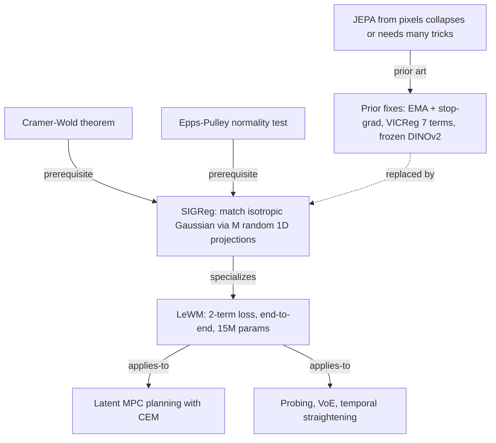
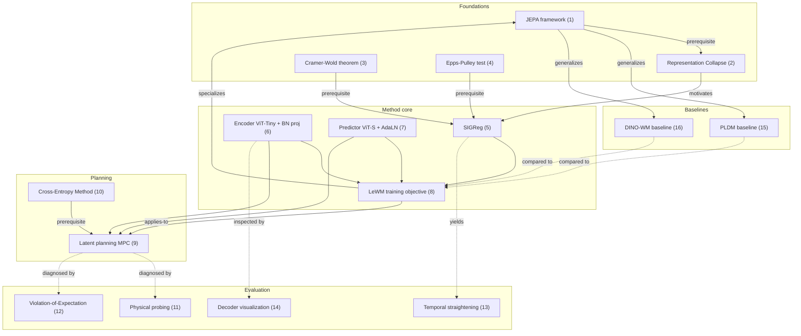

# LeWorldModel Study Note — A Concept Mind-Map

> Paper: *LeWorldModel: Stable End-to-End Joint-Embedding Predictive Architecture from Pixels* (arXiv:2603.19312v2, 2026)
> Authors: Lucas Maes, Quentin Le Lidec, Damien Scieur, Yann LeCun, Randall Balestriero
> Affiliations: Mila & Université de Montréal, NYU, Samsung SAIL, Brown University
> Source archive: [2026_lewm.md](2026_lewm.md) · Reference code: [le-wm-main/](le-wm-main/)

This note organizes every key concept in the paper as a mind-map.
Each concept is broken down into four facets:

- **Definition** — what it is, stated plainly
- **Properties** — its mathematical or behavioral characteristics
- **Application** — how the paper (or the field) uses it
- **Links** — connections to other concepts in this map

---

## 0. The Big Picture

LeWM's story arc: existing JEPAs cannot be trained stably end-to-end from raw pixels without heavy machinery (EMA, stop-gradient, VICReg's seven-term loss, or a frozen DINOv2 encoder). The paper replaces all of these with a **single distribution-matching regularizer (SIGReg)** that pushes embeddings toward an isotropic Gaussian — a mathematically clean anti-collapse term derived from the Cramér–Wold theorem and the Epps–Pulley normality test. The result is a two-term loss with one effective hyperparameter, trained on a single GPU, that plans 48× faster than DINO-WM while matching its task success rate.



**One-line summary**: replace heuristic anti-collapse with a Gaussian-distribution regularizer, and the rest of JEPA training becomes a single, stable two-term objective.

---

## 1. JEPA — The Joint-Embedding Predictive Architecture

### Definition
A framework introduced by LeCun [5] in which a model predicts **future latent states** rather than future pixels. An encoder maps an observation $o_t$ to a compact embedding $z_t = \text{enc}_\theta(o_t)$, and a predictor maps the current embedding and action to the next embedding $\hat{z}_{t+1} = \text{pred}_\phi(z_t, a_t)$. Training matches predicted and target embeddings:

$$\mathcal{L}_{\text{pred}} \triangleq \|\hat{z}_{t+1} - z_{t+1}\|_2^2 \tag{Eq.1}$$

### Properties
- Latent prediction is much cheaper than pixel-space prediction and ignores task-irrelevant visual detail.
- The framework is **action-agnostic at the architectural level**: action conditioning is injected only into the predictor.
- **Vulnerable to representation collapse** (see §2): nothing in Eq.1 alone prevents the encoder from mapping every input to a constant.
- Three families exist depending on how collapse is avoided:
  1. EMA + stop-gradient on a target encoder (I-JEPA, V-JEPA).
  2. Multi-term feature-statistics regularization (PLDM via VICReg).
  3. A pretrained, frozen vision encoder (DINO-WM).

### Application
LeWM is a JEPA in family (2), but with the multi-term regularizer replaced by a single distribution-matching term. The encoder and predictor are jointly optimized end-to-end without EMA, stop-gradient, or auxiliary modalities. Implementation: [le-wm-main/jepa.py:11-55](le-wm-main/jepa.py#L11-L55) (`JEPA.encode` and `JEPA.predict`).

### Links
- → **Representation Collapse** (§2): the failure mode JEPA must defend against.
- → **SIGReg** (§5): LeWM's anti-collapse term, replacing EMA/VICReg/frozen-encoder tricks.
- → **LeWM Training Objective** (§8): how the prediction loss and SIGReg combine.
- → **PLDM Baseline** (§15) and **DINO-WM Baseline** (§16): JEPAs from the other two families.

---

## 2. Representation Collapse

### Definition
A degenerate solution where the encoder maps every input to (nearly) the same vector. Under Eq.1 alone, choosing $\text{enc}_\theta(\cdot) = c$ and $\text{pred}_\phi(z, a) = c$ for any constant $c$ trivially achieves zero loss, yielding an encoder that retains no information.

### Properties
- Pure end-to-end JEPA without any anti-collapse term **always collapses** in practice; this is the central obstacle the paper addresses.
- Multiple existing strategies prevent collapse, each with its own cost:

  | Strategy | Mechanism | Cost |
  |---|---|---|
  | EMA + stop-gradient | Target network slows the trivial drift | No clean objective; theory limited [17] |
  | VICReg (variance / covariance / invariance) | Feature-statistic penalties | Many hyperparameters, unstable |
  | Frozen pretrained encoder | Encoder cannot move | Not end-to-end; representation bounded by pretraining |
  | **Distribution matching (SIGReg)** | Latents must match $\mathcal{N}(0, I)$ | One coefficient $\lambda$; provable guarantee |

- A constant encoder cannot match an isotropic Gaussian distribution, so SIGReg makes collapse infeasible *by construction* (Cramér–Wold gives the asymptotic guarantee, see §3).

### Application
LeWM's design choice is motivated entirely by this failure mode: the entire SIGReg machinery exists to make collapse provably impossible while keeping the training loop simple. Empirically, removing SIGReg (i.e., setting $\lambda = 0$) collapses the encoder; pushing $\lambda$ too large (0.5) destroys the prediction signal (Fig.16).

### Links
- → **JEPA** (§1): the architecture that is prone to collapse.
- → **SIGReg** (§5): the chosen remedy.
- → **PLDM Baseline** (§15): uses VICReg-style variance/covariance terms instead.
- → **DINO-WM Baseline** (§16): sidesteps the problem with a frozen encoder.

---

## 3. Cramér–Wold Theorem

### Definition
A classical result [39] stating that a probability measure on $\mathbb{R}^D$ is uniquely determined by the distribution of all its one-dimensional projections. Specialized to the isotropic Gaussian target, this gives the convergence statement used by SIGReg:

$$\text{SIGReg}(Z) \to 0 \iff \mathbb{P}_Z \to \mathcal{N}(0, I) \tag{Cramer-Wold}$$

### Properties
- Reduces a multivariate normality test (intractable in high $D$) to a family of **univariate** normality tests along directions $u \in \mathbb{S}^{D-1}$.
- The reduction is exact in the limit $M \to \infty$; in practice $M = 1024$ random projections is sufficient (Fig.15 center shows performance is flat from 64 to 1024 projections).
- The theorem requires the 1D projections to cover the unit sphere — directions are sampled uniformly on $\mathbb{S}^{D-1}$ at each step.

### Application
SIGReg uses Cramér–Wold to justify decomposing the embedding-distribution-matching problem into $M$ tractable 1D Epps–Pulley tests (one per projection).

### Links
- → **SIGReg** (§5): the theorem is the theoretical foundation of the regularizer.
- → **Epps–Pulley Test** (§4): the per-projection univariate test SIGReg uses.
- → **Random Projections**: the algorithmic embodiment of Cramér–Wold's "all 1D marginals" requirement.

---

## 4. Epps–Pulley Test

### Definition
A univariate normality test [38] based on comparing the empirical characteristic function (ECF) of a sample to that of $\mathcal{N}(0, 1)$:

$$T^{(m)} = \int_{-\infty}^{\infty} w(t) \left| \phi_N(t; h^{(m)}) - \phi_0(t) \right|^2 dt \tag{EP}$$

where $\phi_N(t; h) = \frac{1}{N} \sum_{n=1}^{N} e^{it h_n}$ is the ECF of the projected sample, $\phi_0$ is the ECF of $\mathcal{N}(0, 1)$, and $w(t) = e^{-t^2 / (2\lambda^2)}$ is a Gaussian weight function that downweights high-frequency mismatch.

### Properties
- **Differentiable** with respect to the samples $h_n$, so the statistic can be backpropagated through the encoder.
- Computed via **quadrature** with $T$ knots (default 17) on a fixed interval (paper says $[0.2, 4]$; reference code uses $[0, 3]$ — see [module.py:13-23](le-wm-main/module.py#L13-L23)).
- The squared modulus splits cleanly: $|\phi_N - \phi_0|^2 = (\text{Re}\,\phi_N - \text{Re}\,\phi_0)^2 + (\text{Im}\,\phi_N - \text{Im}\,\phi_0)^2$. Because $\phi_0$ is real-valued for $\mathcal{N}(0,1)$, the imaginary part reduces to $(\text{Im}\,\phi_N)^2$. The reference implementation uses exactly this decomposition: `(x_t.cos().mean(-3) - phi).square() + x_t.sin().mean(-3).square()` ([module.py:34](le-wm-main/module.py#L34)).
- Number of knots is largely insensitive (Fig.15 right): 4 → 32 knots all give success rate > 80% on Push-T.

### Application
SIGReg applies the Epps–Pulley statistic on each of $M$ random 1D projections and averages. Implementation: [module.py:25-36](le-wm-main/module.py#L25-L36).

### Links
- → **SIGReg** (§5): SIGReg is exactly the average of Epps–Pulley statistics over random projections.
- → **Cramér–Wold Theorem** (§3): justifies using a 1D test in the high-dimensional setting.
- → **Empirical Characteristic Function**: the central object the test compares against the target Gaussian.

---

## 5. SIGReg — Sketched Isotropic Gaussian Regularizer

### Definition
A two-step regularizer that forces the embedding tensor $Z \in \mathbb{R}^{N \times B \times D}$ to look isotropic Gaussian:

1. **Sketch.** Sample $M$ unit-norm directions $u^{(m)} \in \mathbb{S}^{D-1}$ uniformly on the sphere and project: $h^{(m)} \triangleq Z u^{(m)}$.

$$h^{(m)} \triangleq Z u^{(m)}, \quad u^{(m)} \in \mathbb{S}^{D-1} \tag{Eq.6}$$

2. **Test.** Average the Epps–Pulley statistic across projections:

$$\text{SIGReg}(Z) \triangleq \frac{1}{M} \sum_{m=1}^{M} T^{(m)} \tag{Eq.2 / SIGReg}$$

By Cramér–Wold, driving $\text{SIGReg}(Z) \to 0$ drives $\mathbb{P}_Z \to \mathcal{N}(0, I)$.

### Properties
- **Two hyperparameters, one effective.** $M$ (projection count) and $\lambda$ (loss weight). Ablations (Fig.15, Fig.16) show $M$ and integration-knot counts barely affect performance, so $\lambda$ is the only knob that matters in practice.
- **$\lambda$ is forgiving.** Success rate stays above 80% on Push-T for $\lambda \in [0.01, 0.2]$ and peaks near $\lambda = 0.09$ (Fig.16). Performance degrades only at $\lambda \geq 0.5$, where the regularizer dominates the prediction loss.
- **Hyperparameter search is logarithmic.** Because $\lambda$ is the only effective coefficient, a bisection search in $\log\lambda$ suffices — $\mathcal{O}(\log n)$ vs PLDM's $\mathcal{O}(n^6)$ over six coefficients.
- **Provable anti-collapse.** Cramér–Wold's iff statement means a collapsed (constant) embedding distribution cannot satisfy SIGReg $\to 0$.
- **Cheap to compute on a single GPU.** Reference implementation is one matmul plus elementwise trig: [module.py:25-36](le-wm-main/module.py#L25-L36).
- **Applied per timestep, not across time.** SIGReg matches the distribution of $\{z_t\}$ at each step independently; it does **not** regularize the temporal structure. This is exactly why temporal straightening emerges as a byproduct (see §13).

### Application
SIGReg is the sole anti-collapse term in LeWM's loss (§8). It replaces the seven VICReg-style terms in PLDM and removes the need for EMA, stop-gradient, or frozen encoders.

### Links
- → **Cramér–Wold Theorem** (§3): provides the asymptotic guarantee.
- → **Epps–Pulley Test** (§4): the 1D test SIGReg averages.
- → **Representation Collapse** (§2): SIGReg's reason to exist.
- → **LeWM Training Objective** (§8): SIGReg enters as the $\lambda \cdot \text{SIGReg}(Z)$ term.
- → **Temporal Latent Path Straightening** (§13): per-step application of SIGReg leaves the time axis free, which the encoder exploits.

---

## 6. Encoder Architecture

### Definition
A Vision Transformer (ViT-Tiny) [34] with patch size 14, 12 layers, 3 attention heads, hidden dim 192 (∼5M parameters). The CLS token from the final layer is passed through a **projector**: a one-layer MLP followed by Batch Normalization [35].

### Properties
- **The projector is non-optional.** The final ViT layer applies LayerNorm [36], which normalizes per-token statistics. SIGReg needs to operate on the joint distribution across the batch — LayerNorm's per-sample normalization would mask exactly the cross-sample structure SIGReg wants to shape. Replacing the trailing LayerNorm with BatchNorm in the projector restores the cross-sample statistics SIGReg measures.
- **Compact output.** $z_t \in \mathbb{R}^{192}$, two orders of magnitude smaller than the per-patch DINOv2 features used by DINO-WM (this is why LeWM plans ∼50× faster, see Fig.3).
- **Encoder architecture is largely interchangeable.** Replacing ViT with a ResNet-18 backbone yields competitive performance (96.0 vs 94.0 SR on Push-T, Tab.8), suggesting the SIGReg objective — not the encoder family — is the load-bearing design.

### Application
Used as the sole observation encoder. Patches a $224 \times 224$ image into a sequence, runs a 12-layer ViT, and projects the CLS token to a 192-dim embedding ready for the predictor and for SIGReg.

### Links
- → **JEPA** (§1): the encoder is one of JEPA's two components.
- → **SIGReg** (§5): the BatchNorm projector is added specifically to make SIGReg actually constrain the embedding distribution.
- → **Predictor Architecture** (§7): consumes the encoder's output.
- → **Decoder** (§14): the (visualization-only) inverse map used to inspect what the encoder retains.

---

## 7. Predictor Architecture

### Definition
A transformer with 6 layers, 16 attention heads, 10% dropout (∼10M parameters), conditioned on actions via Adaptive Layer Normalization (AdaLN) [37]. Given a history of $N$ embeddings $z_{t-N+1:t}$ and the corresponding actions, it autoregressively predicts $\hat{z}_{t+1}$ with **causal masking** (no peeking at future embeddings). A projector with the same MLP+BN design as the encoder is applied to the predictor's output.

### Properties
- **AdaLN-zero initialization.** The action-conditioning layer is initialized so its outputs are zero, meaning action conditioning is initially a no-op. Conditioning strength grows during training. This protects early training from noisy action gradients. Implementation: [module.py:88-111](le-wm-main/module.py#L88-L111), with `nn.init.constant_(self.adaLN_modulation[-1].weight, 0)` at [module.py:102](le-wm-main/module.py#L102).
- **History length.** $N = 3$ for Push-T and OGBench-Cube; $N = 1$ for TwoRoom.
- **Causal masking.** Identical mechanism to autoregressive language models; required because the predictor is used autoregressively at inference time.
- **10% dropout is critical.** Tab.9 shows success rate drops from 96.0 (at $p = 0.1$) to 78.0 (at $p = 0$) on Push-T. Mild dropout regularizes the predictor and prevents the encoder from "memorizing" idiosyncratic features the predictor cannot use.
- **ViT-S is the sweet spot.** Tab.6: tiny → 80.7 SR, small → 96.0 SR, base → 86.7 SR. Smaller predictors underfit; larger ones train less stably.

### Application
- **At training time** the predictor takes the encoder's output sequence and performs teacher-forced one-step prediction.
- **At planning time** it is rolled out autoregressively for $H = 5$ frame-skip-5 steps (= 25 environment timesteps). See [jepa.py:61-110](le-wm-main/jepa.py#L61-L110).

### Links
- → **Encoder Architecture** (§6): provides the input embeddings.
- → **LeWM Training Objective** (§8): the predictor's output feeds the prediction loss.
- → **Latent Planning** (§9): the predictor is the rollout backbone.
- → **AdaLN** [37]: external technique borrowed for action conditioning.

---

## 8. LeWM Training Objective

### Definition
The complete loss is the sum of a prediction term and a single anti-collapse term:

$$\mathcal{L}_{\text{LeWM}} \triangleq \mathcal{L}_{\text{pred}} + \lambda \, \text{SIGReg}(Z) \tag{Eq.3}$$

with $\mathcal{L}_{\text{pred}}$ from Eq.1 and SIGReg from Eq.2. Default $\lambda = 0.1$, $M = 1024$.

### Properties
- **Only two terms** (vs PLDM's seven; vs DINO-WM's one, but DINO-WM is not end-to-end).
- **Only one effective hyperparameter** ($\lambda$); $M$ is insensitive.
- **No EMA, no stop-gradient, no auxiliary modalities.** Gradients flow through every component end-to-end.
- **Stable across architectures and seeds.** Tab.5: LeWM's three-seed variance on Push-T is $\pm 2.83$ vs PLDM's $\pm 5.0$.
- **Smooth, monotonic training curves** (Fig.18) — both the prediction loss and the SIGReg loss decrease and plateau, in contrast to PLDM's seven curves which oscillate (Fig.19).

### Application
The entire LeWM training procedure is captured in fewer than 20 lines:

```python
def LeWorldModel(obs, actions, lambd=0.1):
    emb       = encoder(obs)               # (B, T, D)
    next_emb  = predictor(emb, actions)    # (B, T, D)
    pred_loss   = F.mse_loss(emb[:, 1:] - next_emb[:, :-1])
    sigreg_loss = mean(SIGReg(emb.transpose(0, 1)))
    return pred_loss + lambd * sigreg_loss
```

Reference implementation: [train.py:18-46](le-wm-main/train.py#L18-L46) (specifically the three loss lines at [train.py:40-42](le-wm-main/train.py#L40-L42)).

### Links
- → **Prediction Loss** (Eq.1, in §1): the $\mathcal{L}_{\text{pred}}$ term.
- → **SIGReg** (§5): the $\lambda \cdot \text{SIGReg}(Z)$ term.
- → **Encoder Architecture** (§6) and **Predictor Architecture** (§7): the two networks jointly optimized.
- → **PLDM Baseline** (§15): the seven-term loss this paper replaces.

---

## 9. Latent Planning (MPC in Embedding Space)

### Definition
Given an initial observation $o_1$ and a goal observation $o_g$, find an action sequence whose latent rollout terminates close to the goal embedding:

$$\hat{z}_{t+1} = \text{pred}_\phi(\hat{z}_t, a_t), \quad \hat{z}_1 = \text{enc}_\theta(o_1)$$

$$\mathcal{C}(\hat{z}_H) = \|\hat{z}_H - z_g\|_2^2, \quad z_g = \text{enc}_\theta(o_g) \tag{Eq.4}$$

$$a^*_{1:H} = \arg\min_{a_{1:H}} \mathcal{C}(\hat{z}_H) \tag{Eq.5}$$

### Properties
- **Terminal-cost-only** — there is no per-step latent reward. The optimization is driven entirely by the H-step latent distance.
- **Frame-skip = 5, planning horizon H = 5.** Effective horizon in environment timesteps: $5 \times 5 = 25$.
- **Receding horizon (MPC).** Only the first $K$ planned actions are executed; the planner replans from the new observation. The paper uses $K = H$ in its main experiments (entire optimized sequence is executed before replanning).
- **Cost is computed in latent space, not pixel space.** This is why LeWM plans 48× faster than DINO-WM: the cost is a 192-dim distance, not a per-patch comparison.

### Application
The planning loop runs at inference time only — the world model weights are frozen. Implementation: rollout at [jepa.py:61-110](le-wm-main/jepa.py#L61-L110), terminal cost at [jepa.py:112-126](le-wm-main/jepa.py#L112-L126), candidate scoring at [jepa.py:128-153](le-wm-main/jepa.py#L128-L153).

### Links
- → **Cross-Entropy Method** (§10): the optimizer that solves Eq.5.
- → **Predictor Architecture** (§7): provides the autoregressive rollouts.
- → **Encoder Architecture** (§6): encodes both the initial and the goal observation.

---

## 10. Cross-Entropy Method (CEM)

### Definition
A zero-order, sampling-based optimizer that maintains a Gaussian distribution over action sequences and iteratively updates its parameters using the statistics of the **elite** subset (lowest-cost samples).

**Algorithm 2 (paper)**:
1. Initialize $\mu_0 = \mathbf{0}, \Sigma_0 = I$.
2. For $t = 1, \ldots, T$:
   - Sample $N$ candidate action sequences $\{a^{(i)}_{1:H}\}_{i=1}^N \sim \mathcal{N}(\mu_{t-1}, \Sigma_{t-1})$.
   - Roll out each candidate in the world model, compute cost $J^{(i)}$.
   - Pick top $K$ as elites $\mathcal{E}$.
   - Update $\mu_t \leftarrow \frac{1}{K} \sum_{i \in \mathcal{E}} a^{(i)}_{1:H}$, $\Sigma_t \leftarrow \text{Var}_{i \in \mathcal{E}}(a^{(i)}_{1:H})$.
3. Return the best sequence found or the first action of $\mu_T$.

### Properties
- **Configuration used in the paper**: $N = 300$ samples, $T = 30$ iterations (10 for non-Push-T envs), $K = 30$ elites, initial $\Sigma_0 = I$.
- **No gradient access required** — the world model is treated as a black-box simulator.
- **No global optimum guarantee** in non-convex landscapes; suffers from the curse of dimensionality when the action space is large.
- **Embarrassingly parallel** — all $N$ rollouts can run as one batched forward pass.

### Application
LeWM uses CEM as its only planning solver. The optimizer's simplicity matches the paper's overall philosophy (one loss term, one solver, one effective hyperparameter).

### Links
- → **Latent Planning** (§9): CEM is the inner solver for the H-step optimization.
- → **Predictor Architecture** (§7): each CEM sample triggers an autoregressive rollout.

---

## 11. Physical Probing

### Definition
A diagnostic that freezes the trained encoder and fits a probe (linear or MLP) to predict a physical quantity (positions, angles, joint velocities, gripper state) from $z_t$. Probe quality is reported as MSE and Pearson correlation $r$ between predicted and ground-truth quantities.

### Properties
- **Linear probe** measures whether the information is **linearly accessible**. A large gap between linear-MSE and MLP-MSE indicates the information exists but is entangled.
- **MLP probe** measures whether the information is **present at all**, regardless of geometry.
- **Three probe locations differ by environment.**

  | Environment | Probed quantities |
  |---|---|
  | Push-T (Tab.1) | Agent location, block location, block angle |
  | TwoRoom (Tab.3) | 2D agent position |
  | OGBench-Cube (Tab.4) | Joint position/velocity, end-effector position/yaw, gripper, block position/quaternion/yaw |

- **LeWM consistently matches or beats PLDM** on positional quantities. On dynamic and rotational properties (joint velocity, end-effector yaw, block quaternion) DINO-WM retains an edge, attributed to DINOv2's pretraining on ∼124M images.

### Application
The probing tables are the paper's primary quantitative argument that LeWM's latent space encodes physical state, not just task-relevant shortcuts. Selected Push-T results (Tab.1):

| Property | Model | Linear MSE↓ | Linear r↑ | MLP MSE↓ | MLP r↑ |
|---|---|---|---|---|---|
| Agent Location | DINO-WM | 1.888 ± 0.500 | **0.977** | 0.003 ± 0.022 | 0.999 |
| Agent Location | PLDM | 0.090 ± 0.311 | 0.955 | 0.014 ± 0.119 | 0.993 |
| Agent Location | **LeWM** | **0.052 ± 0.149** | 0.974 | 0.004 ± 0.056 | 0.998 |
| Block Location | DINO-WM | **0.006 ± 0.007** | **0.997** | 0.002 ± 0.003 | 0.999 |
| Block Location | LeWM | 0.029 ± 0.073 | 0.986 | **0.001 ± 0.006** | 0.999 |
| Block Angle | DINO-WM | **0.050 ± 0.101** | **0.979** | **0.009 ± 0.052** | 0.995 |
| Block Angle | LeWM | 0.187 ± 0.359 | 0.902 | 0.021 ± 0.139 | 0.990 |

The pattern: LeWM dominates on positional quantities; DINO-WM dominates on rotational quantities (block angle / yaw / quaternion), where DINOv2's pretraining helps.

**TwoRoom (Tab.3, agent 2D position).** All three methods land at MSE = 0.000 on MLP probes (the task is essentially solved by any encoder). On the linear probe LeWM and PLDM tie at MSE = 0.008 / r = 0.996, both an order of magnitude better than DINO-WM at MSE = 0.488 / r = 0.824.

**OGBench-Cube (Tab.4, condensed overall row).**

| Model | Linear MSE↓ | Linear r↑ | MLP MSE↓ | MLP r↑ |
|---|---|---|---|---|
| DINO-WM | 1.162 ± 1.579 | **0.725** | **0.290 ± 1.202** | **0.799** |
| PLDM | 0.611 ± 1.875 | 0.464 | 0.503 ± 1.809 | 0.600 |
| **LeWM** | **0.592 ± 1.874** | 0.477 | 0.525 ± 1.714 | 0.584 |

Per-property highlights from Tab.4: LeWM wins on Block Position (Linear MSE 0.007 vs PLDM 0.031, DINO-WM 0.085) and End-Effector Position (Linear MSE 0.018 vs PLDM 0.052, DINO-WM 0.024). DINO-WM keeps a clear lead on Joint Velocity and End-Effector Yaw. All three methods struggle on Block Quaternion and Block Yaw — rotational quantities resist compact latent encoding regardless of training strategy.

### Links
- → **JEPA** (§1): probing tests JEPA representation quality post-hoc.
- → **Decoder** (§14): a qualitative complement — what does the latent space look like?
- → **Violation-of-Expectation** (§12): a complementary dynamic test (does the model react to violations?).
- → **DINO-WM Baseline** (§16): probing exposes where DINOv2's pretraining advantage is real (rotations) and where it isn't (positions).

---

## 12. Violation-of-Expectation (VoE) Framework

### Definition
A diagnostic borrowed from developmental psychology [43] and applied to learned world models [44, 45]: feed the model trajectories with surprising events and measure whether the prediction error spikes at the moment of violation.

### Properties
- **Two perturbation types.**
  - *Visual*: an object's color changes abruptly mid-trajectory (no physical implication).
  - *Physical*: an object is teleported to a random position (violates spatial continuity).
- **Three environments** evaluated: TwoRoom, Push-T, OGBench-Cube.
- **Result**: LeWM's surprise (prediction error) spikes significantly on physical perturbations across all three environments (paired t-test, $p < 0.01$). On visual perturbations the spike is weaker and not consistently significant — the model treats color changes as nuisance variation, as one would hope.

### Application
The VoE results (Fig.10) provide evidence that LeWM has learned the **physics** of the environment, not just visual similarity. Comparable runs on PLDM (Fig.13) and DINO-WM (Fig.14) show similar behavior in 2D environments but markedly weaker physical-perturbation responses in OGBench-Cube — consistent with the harder probing scores on that environment.

### Links
- → **Physical Probing** (§11): the static complement to this dynamic test.
- → **JEPA** (§1): VoE specifically tests JEPA's predictive (not just representational) capacity.

---

## 13. Temporal Latent Path Straightening (Emergent)

### Definition
A scalar measuring how collinear consecutive latent velocity vectors are. Given $z_{1:T} \in \mathbb{R}^{B \times T \times D}$, define velocities $v_t = z_{t+1} - z_t$ and:

$$\mathcal{S}_{\text{straight}} = \frac{1}{B(T-2)} \sum_{i=1}^B \sum_{t=1}^{T-2} \frac{\langle v_t^{(i)}, v_{t+1}^{(i)} \rangle}{\|v_t^{(i)}\| \, \|v_{t+1}^{(i)}\|} \tag{Eq.9}$$

A value close to 1 means consecutive velocities point the same direction — the latent trajectory is locally a straight line.

### Properties
- **Emergent, not enforced.** LeWM has no temporal regularization term, yet $\mathcal{S}_{\text{straight}}$ rises to ∼0.6 during Push-T training (Fig.17).
- **Higher than PLDM** (∼0.4) — even though PLDM explicitly includes a temporal smoothness term $\mathcal{L}_{\text{time-sim}}$.
- **Hypothesized mechanism.** SIGReg is applied **per-timestep** but not across time. The encoder is free to arrange consecutive embeddings linearly because the per-step distribution constraint does not see the temporal axis. The paper calls this a form of "temporal collapse" along the time dimension that turns out to be beneficial.
- **Related work**: Hénaff et al. [42] proposed perceptual straightening in neuroscience; Internò et al. [54] use straightness for AI-video detection; Wang et al. [55] use it for planning.

### Application
Reported as a diagnostic, not optimized. The emergence is offered as evidence that SIGReg's locality-in-time design enables — rather than fights against — useful temporal structure.

### Links
- → **SIGReg** (§5): the per-step application of SIGReg is what leaves the temporal axis free.
- → **JEPA** (§1): straightening is an emergent property of JEPA training, not specific to any one anti-collapse mechanism.
- → **PLDM Baseline** (§15): PLDM's explicit temporal terms are less effective than LeWM's lack of them — the paper's most surprising negative result.

---

## 14. Decoder (Visualization Only)

### Definition
A lightweight transformer decoder that maps the 192-dim CLS embedding back to a $224 \times 224$ RGB image. The embedding is projected to a hidden dim and used as key/value in cross-attention; $P = (224/16)^2 = 196$ learnable query tokens act as queries. Each query is projected to a $16 \times 16 \times 3$ patch and rearranged into the output image.

### Properties
- **Never used during training** — purely a diagnostic.
- **Reconstruction loss hurts downstream control.** Tab.7: LeWM without decoder loss scores 96.0 ± 2.83 on Push-T, with decoder loss 86.0 ± 7.54. The model trained for reconstruction encodes visual details that the planner doesn't need, at the cost of features the planner does need.
- **Reveals what the latent retains.** Fig.8 shows that the decoded images approach the ground truth as training proceeds, even though the model never optimizes pixel-level error.

### Application
Diagnostic tool used to produce Fig.7 (rollout visualizations), Fig.8 (training-time decoded snapshots), Fig.9 (t-SNE of the latent space), and Fig.11 (additional rollouts).

### Links
- → **Encoder Architecture** (§6): inverse map.
- → **JEPA** (§1): shows JEPA encodes enough for *reconstruction* even when it never asks for it.
- → **Physical Probing** (§11): quantitative counterpart — the decoder shows what's there qualitatively.

---

## 15. PLDM Baseline

### Definition
PLDM [21, 22] is the closest competitor: an end-to-end JEPA trained with a VICReg-inspired seven-term loss to prevent collapse.

$$\mathcal{L}_{\text{PLDM}} = \mathcal{L}_{\text{pred}} + \alpha \mathcal{L}_{\text{var}} + \beta \mathcal{L}_{\text{cov}} + \gamma \mathcal{L}_{\text{time-sim}} + \zeta \mathcal{L}_{\text{time-var}} + \nu \mathcal{L}_{\text{time-cov}} + \mu \mathcal{L}_{\text{IDM}} \tag{Eq.8}$$

Components: variance and covariance penalties (VICReg), their temporal versions, a time-similarity smoothness term, and an inverse dynamics modeling (IDM) auxiliary.

### Properties
- **Six tunable coefficients** $(\alpha, \beta, \gamma, \zeta, \nu, \mu)$. Exhaustive search is $\mathcal{O}(n^6)$.
- **Best coefficients found by grid search** (Tab.2):

  | Coefficient | Value |
  |---|---|
  | $\alpha$ (variance) | 18.0 |
  | $\beta$ (covariance) | 12 |
  | $\gamma$ (time-similarity) | 0.2 |
  | $\zeta$ (time-variance) | 0.7 |
  | $\nu$ (time-covariance) | 0.0 |
  | $\mu$ (IDM) | 0.0 |

  The two temporal terms PLDM's original paper added are turned off in the best config.

- **Higher variance across seeds.** Tab.5: PLDM 78.0 ± 5.0 vs LeWM 96.0 ± 2.83 on Push-T.
- **Noisy training curves** (Fig.19) — the IDM, Cov, Std-time, and Cov-time losses oscillate throughout training; the temporal smoothness loss does the opposite of what its name suggests (it grows).

### Application
Used as the primary end-to-end baseline. LeWM matches or exceeds it on every environment except the very simple TwoRoom (where PLDM and DINO-WM both win, attributed to TwoRoom's low intrinsic dimensionality making the Gaussian prior a poor fit).

### Links
- → **JEPA** (§1): PLDM is a fellow JEPA.
- → **Representation Collapse** (§2): PLDM's anti-collapse mechanism is VICReg + temporal terms.
- → **LeWM Training Objective** (§8): the loss this paper replaces.
- → **VICReg** [23]: external method PLDM specializes.

---

## 16. DINO-WM Baseline

### Definition
DINO-WM [18] is the closest **foundation-encoder** baseline: it freezes a DINOv2 [41] vision encoder and trains only the predictor on next-embedding MSE.

$$\mathcal{L}_{\text{DINO-WM}} = \frac{1}{BT} \sum_{i=1}^B \sum_{t=1}^T \|\hat{z}^{(i)}_{t+1} - z^{(i)}_{t+1}\|_2^2 \tag{Eq.7}$$

### Properties
- **Anti-collapse for free.** A frozen encoder cannot collapse, so no regularizer is needed.
- **Pretraining cost amortized.** DINOv2 was trained on ∼124M images — most of the representational work is done before DINO-WM training begins.
- **Expensive at planning time.** DINO-WM operates on per-patch features (∼196 tokens per frame), so each planning step is two orders of magnitude more expensive than LeWM's single 192-dim CLS embedding. Fig.3: 47s vs 0.98s per plan.
- **Strong on rotational properties.** DINOv2's diverse pretraining gives it an edge on block angle, end-effector yaw, joint velocity (Tab.1, Tab.4).
- **Excludes proprioceptive inputs** for fair comparison (paper standard); the original DINO-WM also uses proprioception, which boosts its scores but breaks pixel-only comparability.

### Application
Strong upper-bound baseline. LeWM matches DINO-WM on Push-T and Reacher, slightly underperforms on OGBench-Cube (the visually richer 3D environment where DINOv2's pretraining helps most), and underperforms on TwoRoom (where neither method has much to learn).

### Links
- → **JEPA** (§1): DINO-WM is a foundation-encoder JEPA.
- → **Representation Collapse** (§2): DINO-WM sidesteps the problem entirely.
- → **Latent Planning** (§9): DINO-WM's per-patch latent makes planning expensive.

---

## 17. What Existed Before and What This Paper Changes

### 17.1 Prior Approaches and Their Limitations

**EMA + stop-gradient JEPAs (I-JEPA, V-JEPA, Brain-JEPA, Echo-JEPA).** These methods avoid collapse by maintaining a slowly updated target encoder via exponential moving average, and by stopping gradients on the target branch. The trick works in practice but does not correspond to the minimization of any well-defined objective [17]. As a result, training behavior is hard to predict, and there is no theoretical handle on when or why collapse is avoided.

**VICReg-style end-to-end JEPAs (PLDM).** PLDM trains the encoder and predictor jointly using VICReg's variance and covariance penalties plus four temporal variants and an inverse-dynamics auxiliary — seven terms total, six tunable coefficients. The coefficients must be re-tuned per environment, and the best configuration ([Tab.2](2026_lewm.md)) turns two of the original temporal terms off. The training is noisy (Fig.19) and the seed variance is high (±5.0 on Push-T).

**Foundation-encoder JEPAs (DINO-WM, OSVI-WM, V-JEPA-2 for planning).** Freeze a pretrained vision encoder (typically DINOv2 with ∼124M images of pretraining) and train only a predictor. This avoids collapse trivially but caps the representation at the pretraining distribution and forces planning to operate on a high-resolution patch-token grid, which is computationally expensive — DINO-WM takes ∼47 s per Push-T plan.

**Generative world models (Dreamer, IRIS, DIAMOND, Genie).** These approaches model the environment in pixel space and require reward signals or task labels. They are excellent for in-task RL but unsuited to the reward-free, task-agnostic regime this paper targets.

**Goal-conditioned offline-RL and imitation baselines (GCBC, GCIVL, GCIQL).** Train a policy directly on (state, action, goal) tuples from the offline dataset — GCBC via supervised regression, GCIVL/GCIQL via expectile-regression value learning plus advantage-weighted regression. These methods skip world modeling entirely; they are reported in the paper's Fig.6 as policy baselines and trail PLDM/DINO-WM/LeWM in nearly every environment. Their relevance here is to confirm that world-model planning is the right comparison axis, not policy fitting.

### 17.2 What This Paper Contributes

**Contribution 1 — A two-term, end-to-end JEPA loss.** Replace the entire collapse-avoidance toolkit (EMA, stop-gradient, VICReg, frozen encoders) with a single distribution-matching term: SIGReg. The result is a clean two-term loss with one effective hyperparameter and a provable anti-collapse guarantee via Cramér–Wold.

**Contribution 2 — 15M parameters, single-GPU, 48× faster planning.** Compact CLS-token embeddings make rollouts and goal-distance computations cheap. Full planning completes in under one second on Push-T, vs ∼47 s for DINO-WM.

**Contribution 3 — A physical-understanding evaluation.** The paper does not stop at task success rate. It probes the latent space for physical quantities (Tab.1, 3, 4), runs violation-of-expectation tests (Fig.10), and documents an emergent temporal-straightening phenomenon (Fig.17). Together these show that LeWM's representation captures physics — not just shortcuts that happen to satisfy the planner.

### 17.3 Side-by-Side Comparison

| Dimension | EMA-JEPA (I-JEPA/V-JEPA) | PLDM | DINO-WM | **LeWM** |
|---|---|---|---|---|
| End-to-end from pixels | yes | yes | no (frozen encoder) | **yes** |
| Anti-collapse mechanism | EMA + stop-grad (no clean objective) | 7-term VICReg + temporal | frozen encoder | **SIGReg (Cramér–Wold)** |
| Loss-term count | ≥ 2 + EMA | 7 | 1 | **2** |
| Effective hyperparameters | EMA decay + others | 6 (α, β, γ, ζ, ν, μ) | 0 anti-collapse | **1 ($\lambda$)** |
| Provable anti-collapse | no | no | trivial (frozen) | **yes** |
| Plan time on Push-T | n/a | ∼1 s | ∼47 s | **∼0.98 s** |
| Push-T SR (seed mean ± std) | n/a | 78.0 ± 5.0 | 92.0 ± 1.63 | **96.0 ± 2.83** |
| Compute scale | many GPUs | single GPU | inherits DINOv2 pretraining cost | **single GPU, hours** |

### 17.4 The Core Shift in Thinking

Earlier JEPA work treated anti-collapse as a **patch on the loss**: add penalties on feature statistics until the encoder stops collapsing, then tune the coefficients per environment. The patches multiply because each statistic (variance, covariance, temporal variance, temporal covariance) addresses one failure mode in isolation.

LeWM treats anti-collapse as a **distributional question**: if the embedding distribution matches $\mathcal{N}(0, I)$, no degenerate (constant or low-rank) solution can satisfy the constraint. Cramér–Wold then lets that distributional claim be enforced with a sum of one-dimensional normality tests, which are differentiable and cheap. The shift is from "penalize observed failure modes" to "constrain the distribution and let failure modes become geometrically impossible."

A practical consequence: temporal smoothness, which PLDM tries to encourage with three additional loss terms, emerges in LeWM **without any temporal regularization** (§13). When the right distributional constraint is enforced per timestep, the encoder finds a temporally smooth solution on its own. PLDM's explicit smoothness terms are not just unnecessary — they are weaker than the implicit smoothness LeWM gets for free.

---

## 18. Quick Reference Card

| # | Insight | Design Choice | Evidence |
|---|---|---|---|
| 1 | Multi-term VICReg-style anti-collapse can be replaced by a single distribution-matching term | SIGReg as sole anti-collapse loss | Tab.5 (lower variance), Fig.18 vs Fig.19 (smoother curves) |
| 2 | Number of random projections in SIGReg is largely irrelevant | $M = 1024$ default; ablation 64–1024 | Fig.15 center |
| 3 | Number of integration knots in Epps–Pulley is largely irrelevant | 17 knots default; ablation 4–32 | Fig.15 right |
| 4 | $\lambda$ is the only hyperparameter that matters; broad sweet spot | $\lambda = 0.1$ default; SR > 80% over $\lambda \in [0.01, 0.2]$ | Fig.16 |
| 5 | Compact CLS-token latents dramatically reduce planning cost | 192-dim CLS vs per-patch DINOv2 | Fig.3 (48× speedup) |
| 6 | Decoder/reconstruction loss hurts control performance | LeWM trains without decoder loss | Tab.7 (96.0 → 86.0 with decoder) |
| 7 | Embedding dim has a threshold (≈ 184) below which performance collapses | Default 192 | Fig.15 left |
| 8 | Predictor dropout (p = 0.1) is critical | 10% dropout default | Tab.9 (78 → 96 from p=0 to p=0.1) |
| 9 | ViT-S is the predictor sweet spot | ViT-S default | Tab.6 (tiny 80.7, small 96.0, base 86.7) |
| 10 | Encoder architecture is interchangeable | ViT-Tiny default; ResNet-18 works too | Tab.8 (96.0 vs 94.0) |
| 11 | Temporal smoothness emerges without explicit regularization | No temporal loss term in LeWM | Fig.17 (LeWM ≈ 0.6, PLDM ≈ 0.4) |
| 12 | SIGReg's Gaussian prior is a poor fit for very low-dimensional environments | TwoRoom underperformance | Fig.6 left |

---

## 19. Open Questions

The paper's Conclusion explicitly identifies four directions:

- **Long-horizon planning.** Current planning is limited to $H = 5$ frame-skip steps. Auto-regressive prediction errors accumulate; hierarchical world models could extend the horizon.
- **Reducing the need for offline interaction data.** Pre-training on large, diverse natural-video datasets could provide stronger priors and lift the data-coverage requirement, especially in low-dimensional environments where the Gaussian prior is mismatched.
- **Removing the action-label dependency.** Current training needs paired $(o_t, a_t)$. Learning action representations through inverse dynamics modeling could let LeWM consume unlabeled video.
- **Bridging the Gaussian-prior gap in simple environments.** In TwoRoom the isotropic Gaussian prior in 192 dimensions is a poor match for a low-intrinsic-dimensionality dataset. A learnable or adaptive prior could close the small but real gap with PLDM and DINO-WM on such tasks.

Beyond what the paper explicitly raises, three natural follow-ups stand out:

- **Theoretical analysis of the temporal-straightening phenomenon.** The paper hypothesizes a mechanism but does not prove it. A formal statement would clarify when straightening helps planning and when it hurts.
- **Co-training the prior.** Replace $\mathcal{N}(0, I)$ with a learned anisotropic target whose covariance reflects environment complexity.
- **Scaling.** All experiments are on ≤ 20k-episode datasets and 224 × 224 frames. Whether the two-term recipe holds at multi-million-trajectory scale is open.

---

## 20. Concept Dependency Graph



Dotted arrows mark diagnostic / comparison relations; solid arrows mark architectural or theoretical dependence.

---

## 21. Key Equations

| Eq | Where | Statement | Role |
|---|---|---|---|
| LeWM | §1, p.5 | $z_t = \text{enc}_\theta(o_t)$, $\hat{z}_{t+1} = \text{pred}_\phi(z_t, a_t)$ | JEPA's encoder/predictor pair |
| 1 | §1, p.5 | $\mathcal{L}_{\text{pred}} \triangleq \|\hat{z}_{t+1} - z_{t+1}\|_2^2$ | Per-step prediction MSE |
| 2 / SIGReg | §5, p.5/15 | $\text{SIGReg}(Z) \triangleq \frac{1}{M} \sum_{m=1}^M T^{(m)}$ | Average of Epps–Pulley statistics |
| 3 | §8, p.5 | $\mathcal{L}_{\text{LeWM}} \triangleq \mathcal{L}_{\text{pred}} + \lambda \, \text{SIGReg}(Z)$ | Total LeWM loss |
| 4 | §9, p.6 | $\mathcal{C}(\hat{z}_H) = \|\hat{z}_H - z_g\|_2^2$ | Terminal latent goal cost |
| 5 | §9, p.6 | $a^*_{1:H} = \arg\min_{a_{1:H}} \mathcal{C}(\hat{z}_H)$ | Optimal action sequence |
| 6 | §5, p.15 | $h^{(m)} \triangleq Z u^{(m)}, \, u^{(m)} \in \mathbb{S}^{D-1}$ | SIGReg projection step |
| EP | §4, p.16 | $T^{(m)} = \int w(t) \|\phi_N - \phi_0\|^2 dt$ | Univariate Epps–Pulley statistic |
| Cramer–Wold | §3, p.16 | $\text{SIGReg}(Z) \to 0 \iff \mathbb{P}_Z \to \mathcal{N}(0, I)$ | Asymptotic convergence guarantee |
| 7 | §16, p.17 | $\mathcal{L}_{\text{DINO-WM}} = \frac{1}{BT} \sum \|\hat{z}_{t+1} - z_{t+1}\|_2^2$ | DINO-WM baseline loss |
| 8 | §15, p.17 | $\mathcal{L}_{\text{PLDM}} = \mathcal{L}_{\text{pred}} + \alpha \mathcal{L}_{\text{var}} + \cdots + \mu \mathcal{L}_{\text{IDM}}$ | PLDM baseline (7-term) loss |
| 9 | §13, p.27 | $\mathcal{S}_{\text{straight}} = \frac{1}{B(T-2)} \sum \frac{\langle v_t, v_{t+1} \rangle}{\|v_t\| \|v_{t+1}\|}$ | Mean cosine similarity of consecutive velocities |

---

## 22. Reference Map

**JEPA family and prior anti-collapse strategies**
- [5] LeCun (2022) — original JEPA position paper.
- [12] I-JEPA (Assran et al., CVPR 2023) — image-domain JEPA with EMA + stop-grad.
- [13, 14] V-JEPA, V-JEPA-2 (Bardes et al.; Assran et al., 2025) — video-domain JEPAs.
- [15] Brain-JEPA, [16] Echo-JEPA — domain-specific JEPAs.
- [17] Ponce et al. (ICLR 2026) — theoretical limits of non-contrastive SSL (EMA/SG analysis).
- [23] VICReg (Bardes et al., ICLR 2022) — feature-statistics regularization for SSL.

**End-to-end and foundation-encoder world models**
- [18] DINO-WM (Zhou et al., ICML 2025) — foundation-encoder baseline.
- [19, 20] OSVI-WM, Causal-JEPA — auxiliary-signal JEPAs.
- [21] Sobal et al. (2022) — original PLDM precursor.
- [22] Sobal et al. (RoboLearn 2025) — PLDM main baseline.
- [25] Balestriero & LeCun (2025) — LeJEPA / SIGReg origin.
- [41] DINOv2 (Oquab et al., TMLR 2024) — vision encoder used by DINO-WM.

**Generative and task-specific world models**
- [3] IRIS, [6] DIAMOND, [7] ∆-IRIS, [8] OASIS, [4] DreamerV4, [9] Genie, [10] HunyuanWorld, [11] WorldGym.
- [26]-[29] Original Ha & Schmidhuber + Dreamer line.
- [30]-[33] MPC and TD-MPC lines.

**Theoretical and statistical foundations**
- [38] Epps & Pulley (Biometrika 1983) — the univariate normality test.
- [39] Cramér & Wold (J. London Math. Soc. 1936) — the projection theorem.
- [42] Hénaff, Goris, Simoncelli (Nature Neuroscience 2019) — perceptual straightening.
- [40] Rubinstein & Kroese (2004) — Cross-Entropy Method.

**Evaluation framework**
- [43] Margoni, Surian, Baillargeon (Psych. Review 2024) — VoE paradigm overview.
- [44] Garrido et al. (2025) — intuitive physics from self-supervised pretraining.
- [45] Bordes et al. (2025) — IntPhys 2 benchmark.

**Probing / control baselines**
- [46] Kostrikov et al. (IQL, 2021).
- [47] Park et al. (OGBench, ICLR 2025).
- [48] Ghosh et al. (GCBC, 2019).

**Tooling and infrastructure**
- [34] ViT (Dosovitskiy, 2020), [35] BatchNorm, [36] LayerNorm, [37] AdaLN (DiT).
- [49] stable-pretraining-v1 (Balestriero et al., 2025).
- [50] stable-worldmodel-v1 (Maes et al., 2026).
- [51] PyTorch, [52] Gymnasium, [53] DeepMind Control Suite.

**Temporal straightening downstream**
- [54] Internò et al. (NeurIPS 2025) — AI-generated video detection.
- [55] Wang et al. (2026) — temporal straightening for planning.
