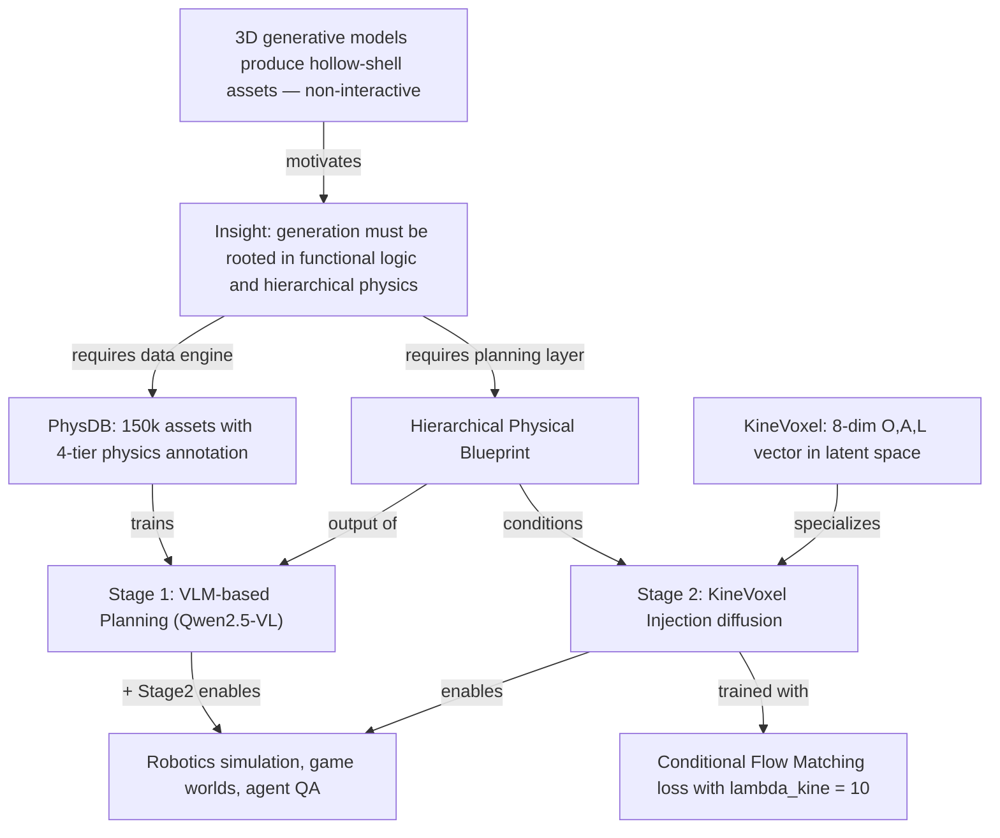
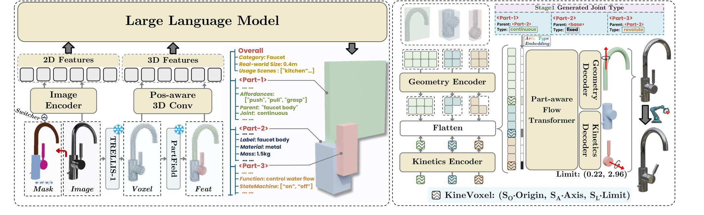
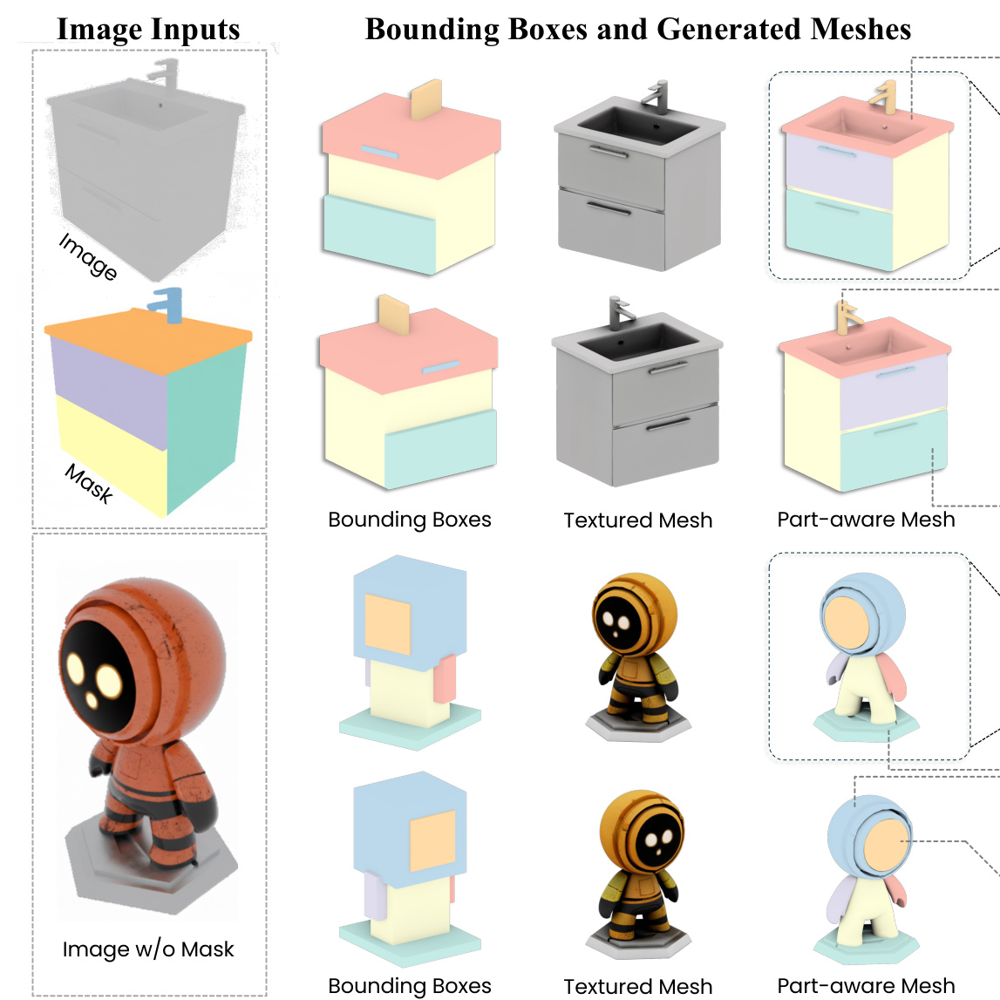
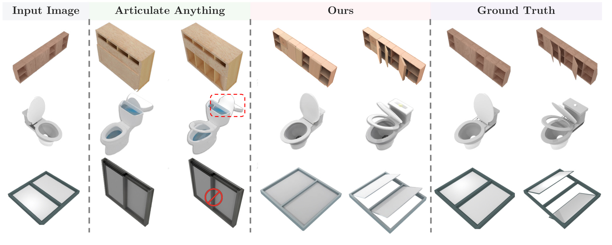
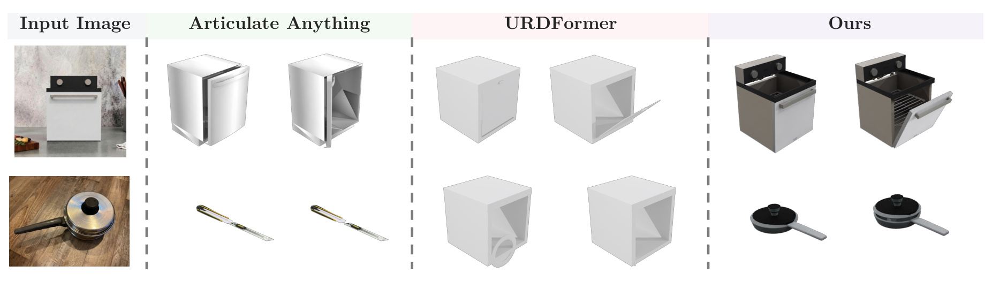
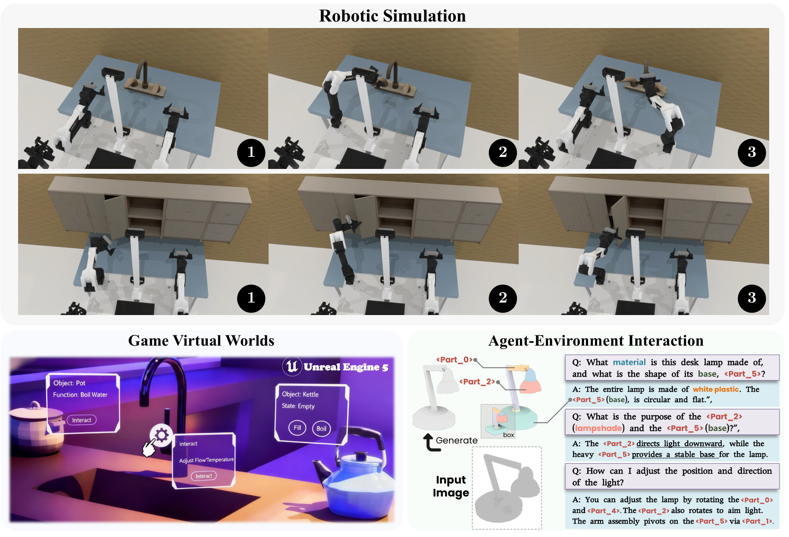
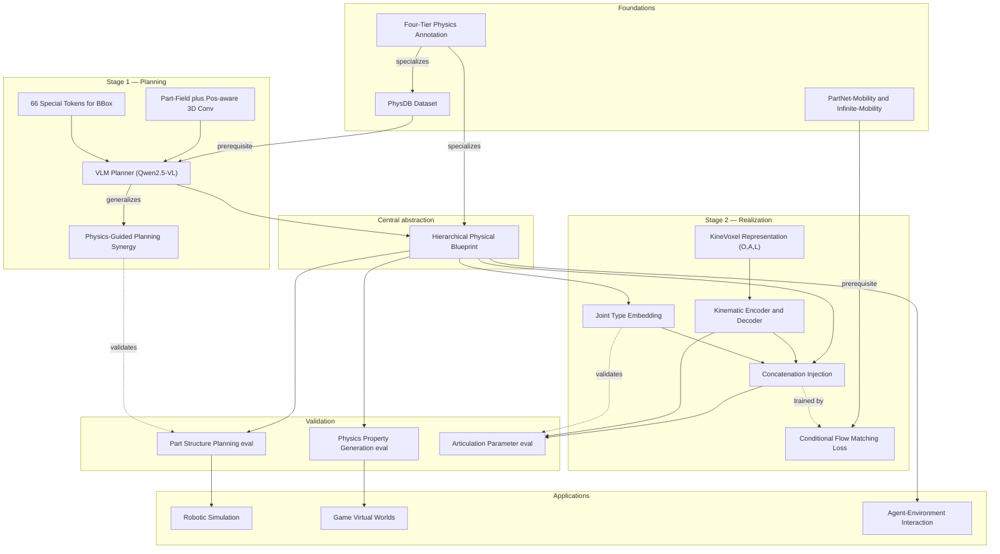

# PhysForge Study Note — A Concept Mind-Map

> Paper: PhysForge: Generating Physics-Grounded 3D Assets for Interactive Virtual World (arXiv:2605.05163)
> Authors: Yunhan Yang, Chunshi Wang, Junliang Ye, Yang Li, Zanxin Chen, Zehuan Huang, Yao Mu, Zhuo Chen, Chunchao Guo, Xihui Liu
> Affiliations: HKU · Tencent Hunyuan · ZJU · THU · SJTU · BUAA
> Source archive: [2026_physforge.md](2026_physforge.md)

This note organizes every key concept in the paper as a mind-map.
Each concept is broken down into four facets:

- **Definition** — what it is, stated plainly
- **Properties** — its mathematical or behavioral characteristics
- **Application** — how the paper (or the field) uses it
- **Links** — connections to other concepts in this map

---

## 0. The Big Picture

---

## 1. Physics-Grounded 3D Generation

### Definition
The task of generating, from a single input image, a 3D asset whose every part carries explicit physics: scale, material, mass, intrinsic function, state machine, atomic affordances, and (for movable parts) kinematic joint definition. Output is *simulation-ready* — agents can grasp, push, rotate, and articulate parts without manual rigging.

### Properties
- **Goes beyond static geometry**: Standard 3D generators (TRELLIS, CLAY, 3DShape2VecSet) produce holistic shape + texture only. PhysForge's output additionally encodes physics, function, and articulation.
- **Single-image input**: No multi-view, no text-only — one RGB image plus an *optional* 2D part mask for granularity control.
- **Part-aware by construction**: Generation is decomposed per-part, never holistic.
- **Hierarchical**: Properties annotated at object level (holistic) and part level (static · functional · interactive).

### Application
- Robotic simulation: assets are imported into RoboTwin with functional parts directly manipulable.
- Game worlds: assets enter Unity/UE with mass, material, articulation pre-attached — no manual rigging.
- Agent-environment interaction: VLA can query the asset in natural language and receive a physical blueprint for task planning.

### Links
- → **§2 Four-Tier Hierarchical Physics**: The annotation schema that operationalizes "physics-grounded."
- → **§4 Hierarchical Physical Blueprint (HPB)**: The output object that contains all these properties for a single asset.
- → **§13 Prior Art**: Distinguishes from *static* generation (TRELLIS, CLAY) and *holistic-only physics* (PhysX-3D, EmbodiedGen).

---

## 2. Four-Tier Hierarchical Physics Annotation

### Definition
A schema that decomposes "physics of an asset" into four orthogonal tiers, organized top-down from whole-object to per-part interaction:

| Tier | Scope | Examples of fields |
|---|---|---|
| **Holistic** | Object level | real-world scale, object category, usage scene (kitchen, bedroom) |
| **Static** | Part level | semantic label, physical material (metal, wood, ceramic), mass |
| **Functional** | Part level | intrinsic function ("to contain", "to control"), state machine (Button: [pressed, released]) |
| **Interactive** | Part level | atomic affordances (pushable, graspable, rotatable); for movables: parent part, joint type, joint axis · origin · limits |

### Properties
- **Orthogonal axes**: Each tier captures a distinct facet — geometry alone doesn't predict mass; mass alone doesn't predict affordance. The tiers compose multiplicatively.
- **Inspired by OAKINK2** (Zhan et al., 2024) for functional tier definitions.
- **Joint type vocabulary** (interactive tier): revolute, continuous, prismatic, fixed.
- **Joint parameters** (continuous): axis origin $O \in \mathbb{R}^3$, axis direction $A \in \mathbb{R}^3$, motion limits $L \in \mathbb{R}^2$ — total 8 dimensions per part.

### Application
- Drives the **PhysDB annotation pipeline** (§3) — multi-modal LLM emits initial annotations conforming to this schema, then human-in-the-loop correction.
- Defines what the **VLM planner (§6)** must auto-regressively emit per part.
- The interactive tier's 8-dim kinematic vector is the input to the **KineVoxel encoder (§7.1–7.2)**.

### Links
- → **§3 PhysDB**: This schema is the spec; PhysDB is the corpus annotated under it.
- → **§4 Hierarchical Physical Blueprint**: HPB is the per-asset instantiation of this schema.
- → **§7.1 KineVoxel Representation**: The 8-dim interactive-tier kinematics is packaged as the KineVoxel.

---

## 3. PhysDB: A Physics-Grounded Dataset

### Definition
A new dataset of **150 000 3D objects** sourced from Objaverse (Deitke et al., 2023), annotated under the four-tier schema. Covers seven major categories: household, industrial, weapons, personal, vehicles, tech & electronics, cultural items.

### Properties
- **Selection criteria**: Only objects with meaningful part structure that are amenable to the physics annotation pipeline.
- **Annotation pipeline**: Human-in-the-loop process.
  1. Render whole-object and per-part images.
  2. Feed to multi-modal LLM → initial annotations.
  3. Manual screening and correction.
- **Deliberate kinematic gap**: PhysDB does **not** annotate precise numerical joint axes at 150k scale (inaccurate at scale). It provides only joint *type* and other physics properties.
- **Supplemental kinematic corpora**: To close the gap, training is augmented with **PartNet-Mobility** (Xiang et al., 2020) and **Infinite-Mobility** (Lian et al., 2025), which provide ground-truth articulation parameters for the diffusion stage.

### Application
- Trains **Stage 1 (VLM planner)** on full 4-tier supervision.
- Trains **Stage 2 (diffusion)** on physics + supplemental joint-axis data.
- Provides the new evaluation test split (1 000 cases sampled uniformly per category) used in Table 2.

### Links
- → **§2 Four-Tier Annotation**: PhysDB is the corpus realization of the schema.
- → **§6 VLM Planner**: PhysDB supervises planner output structure.
- → **§13 Prior Art**: Contrasts with PhysXNet (Cao et al., 2025a), which annotates physics on top of PartNet (~10k objects). PhysDB scales 15× and broadens category coverage.

---

## 4. Hierarchical Physical Blueprint (HPB)

### Definition
The structured output of Stage 1 — a per-asset document that fully specifies the planned part decomposition together with all four tiers of physics. Concretely, for each planned part it lists: bounding box (6 quantized tokens), parent part, semantic label, material, mass, intrinsic function, state machine, atomic affordances, and (for movables) joint type.

### Properties
- **Discrete + structured**: All HPB fields are categorical or quantized, making them amenable to auto-regressive LLM generation.
- **Joint type is qualitative only**: HPB specifies *that* a joint is revolute, but **not** the precise axis/origin/limits — those are delegated to Stage 2 (§7).
- **Granularity-controllable**: An optional 2D part mask supplied to the planner controls how finely parts are split.
- **Standalone interpretable**: A VLA agent can read the HPB in natural language to plan manipulation tasks, independent of geometry generation.

### Application
- Output of **§6 VLM Planner**.
- Condition input to **§7 KineVoxel Injection diffusion** — specifically, the joint type feeds into $E_{type}$ (§7.3) and bounding boxes feed structural priors.
- Returned to embodied agents as a queryable interface (Figure 6c).

### Links
- → **§6 VLM Planner**: Generator of HPB.
- → **§7.3 Joint Type Embedding**: The bridge that lifts HPB's qualitative joint type into Stage 2.
- → **§12 Applications**: HPB is the substrate the agent queries.

---

## 5. Two-Stage Decoupled Framework

### Definition
PhysForge's overall architecture: **planning** is separated from **realization**.

- **Stage 1 (Planning)**: A finetuned VLM ingests image + voxel + optional mask, emits the HPB as text tokens.
- **Stage 2 (Realization)**: A diffusion model ingests the HPB, synthesizes high-fidelity geometry + texture + precise kinematic parameters jointly.

### Properties
- **Specialized strengths**: VLMs have strong world knowledge and discrete structural reasoning; diffusion models excel at precise continuous synthesis. Decoupling lets each do what it is best at.
- **Inspired by 2D multimodal "planning-then-generation"** paradigms (Sun et al., 2024; Chen et al., 2025a).
- **Communicates via HPB**: HPB is the entire interface between the two stages — no shared embeddings or end-to-end gradients across stages.
- **Failure isolation**: Each stage can be evaluated independently (planning eval in §4.1, realization eval in §4.2 of paper).

### Application
- Stage 1 trained on 500k+ part-level data with full HPB supervision.
- Stage 2 extends OmniPart (Yang et al., 2025) second-stage framework — the geometry pipeline — with KineVoxel injection.

### Links
- → **§6 Stage 1**, **§7 Stage 2**: The two sub-systems.
- → **§4 HPB**: The interface between them.
- → **§13 Prior Art**: Contrast with end-to-end approaches (PhysX-3D's Physical VAE).

---

## 6. Stage 1 — VLM as a Physical Blueprint Planner

### Definition
A finetuned **Qwen2.5-VL** (Bai et al., 2025) that auto-regressively emits the HPB given (image $I$, voxel $V$, optional 2D mask $M$).

### 6.1 Input Encoding

#### Definition
- Image $I$ and color-coded 2D mask $M$: processed by Qwen's native image encoder.
- Voxel $V$ (obtained from TRELLIS Stage 1): encoded with a custom **Part-Field encoder** (Liu et al., 2025b) → per-voxel features → position-aware 3D ConvNet → **512-dim voxel embedding**.

#### Properties
- The Part-Field encoder is preferred over the common 3DShape2VecSet encoder (Zhang et al., 2023) for *better part-aware and local information* — the planner needs to reason about which voxels belong together.
- Image and mask share an encoder; voxel has a dedicated branch with its own 3D conv.

#### Application
- Feeds the unified token stream of the LLM in Figure 2 (left half).

#### Links
- → **§6.2 Special-Token Bounding Box**: The output side of the VLM that produces the HPB.
- → **§3 PhysDB**: Provides paired (image, voxel, mask, HPB) training tuples.

### 6.2 Special-Token Bounding Box Quantization

#### Definition
A vocabulary extension that lets the VLM emit 3D axis-aligned bounding boxes as discrete tokens. Total **66 new special tokens**:
- `<boxs>` and `<boxe>` — bounding-box delimiters.
- `<box0>`, `<box1>`, ..., `<box63>` — 64 quantized coordinate tokens.

#### Properties
- **6 tokens per box**: A 3D axis-aligned box has 6 numbers (xyz min + xyz max). With 64-level quantization, each axis-aligned box is just 6 tokens between `<boxs>` and `<boxe>`.
- **Highly compact**: Drastically shorter than emitting floats as digit-by-digit text.
- **Quantization tradeoff**: 64 levels per axis — coarser than continuous floats but sufficient for *planning*, while precise kinematics is delegated to Stage 2.

#### Application
- The planner emits structured tokens like: `<part> <boxs> <box12> <box37> ... <boxe> <material:metal> <mass:1.5> ...` per part of the HPB.

#### Links
- → **§4 HPB**: This token format is the HPB's serialization.
- → **§7.3 Joint Type Embedding**: Joint type predicted as a discrete token here becomes $E_{type}$ in Stage 2.

### 6.3 Physics-Guided Planning Synergy *(key insight)*

#### Definition
**A discovery, not a module**: training the VLM to co-predict physical properties (material, function, affordance) *alongside* bounding boxes provides stronger semantic constraints that significantly improve part-decomposition quality — even when no 2D mask is provided.

#### Properties
- **Why it works**: Material/function predictions force the VLM to commit to *what a part is for*, which resolves geometric ambiguity (where to split). E.g., once the model commits to "this part is a *handle* used to *grasp*", the bounding box collapses to a coherent grip region.
- **Quantitative evidence (Table 3)**:

| Method | Voxel Recall ↑ | Voxel IoU ↑ | BBox IoU ↑ |
|---|---|---|---|
| PartField | 69.65 | 46.04 | 37.33 |
| OmniPart (SAM mask) | 68.33 | 43.34 | 34.33 |
| **PhysForge-bbox (w/o mask, no physics)** | **67.89** | **35.53** | **32.30** |
| **PhysForge (w/o mask, with physics)** | **73.63** | **47.66** | **36.32** |
| OmniPart | 73.79 | 52.92 | 41.66 |
| **PhysForge (Ours)** | **77.16** | **53.74** | **42.95** |

  Rows 3 vs 4 isolate the effect: same architecture, only adding physics co-prediction lifts Voxel IoU from 35.53 → 47.66 (+12.13). Row 4 (no mask, with physics) outperforms row 2 (with SAM mask, no physics).

#### Application
- Justifies why physics annotation is not a "side dish" but a *core training signal* for the planner.
- Argues against pure-geometric planners (PartField, OmniPart first stage without physics).

#### Links
- → **§2 Four-Tier Annotation**: The physics signals (material, function, affordance) come from the schema.
- → **§3 PhysDB**: Provides the co-supervision data.
- → **§14 Quick Reference Card** (Insight #1).

### Links (Stage 1 overall)
- → **§5 Two-Stage Framework**: This is the planning half.
- → **§4 HPB**: This is what Stage 1 produces.

---

## 7. Stage 2 — KineVoxel Injection (KVI)

### Definition
The novel mechanism that lets a single diffusion model jointly denoise *geometric latents* and *kinematic parameters* in a shared latent space, conditioned on the HPB from Stage 1.

### Properties (overall)
- **Built on OmniPart's second stage** (Yang et al., 2025) as the geometry backbone.
- **Key trick**: Treat kinematic parameters as another "voxel-like" latent token (the *KineVoxel*) that participates in the same denoising transformer as geometry latents.
- **Why diffusion, not VLM, for kinematics**: VLMs are ill-suited for predicting precise continuous 3D values (origin coordinate, axis vector) — that's the diffusion model's specialty.

### 7.1 KineVoxel Representation

#### Definition
For each movable part $i$, package its articulation parameters into an 8-dimensional vector:

$$
P_i = (O_i,\, A_i,\, L_i)
$$

with $O_i \in \mathbb{R}^3$ (joint origin), $A_i \in \mathbb{R}^3$ (joint axis direction), $L_i \in \mathbb{R}^2$ (motion limits).

The KineVoxel is the latent token that represents $P_i$ in the diffusion transformer's space.

#### Properties
- **8 dims total**: 3 + 3 + 2.
- **Per-part**: One KineVoxel per movable part. Fixed parts get no KineVoxel.
- **Limit field example**: `Limit: (0.22, 2.96)` (visible in Figure 2 right panel) — a closed interval of motion.

#### Application
- Encoded by $E_{kine}$ (§7.2) into the shared latent space where geometry voxel latents $Z_g = \{z_{g,i}\}$ also live.

#### Links
- → **§2 Interactive Tier**: $(O, A, L)$ exactly matches the interactive tier's kinematic fields.
- → **§7.2 Kinematic Encoder/Decoder**: How the 8-dim vector becomes a latent token.

### 7.2 Kinematic Encoder / Decoder

#### Definition
Two independent **lightweight 2-layer MLPs**:
- $E_{kine}$: maps the scaled, concatenated $(O_i, A_i, L_i)$ to a latent token $z_{k,i}$.
- $D_{kine}$: maps a denoised latent back to articulation parameters.

The encoder equation:

$$
z_{k,i} = E_{kine}(\operatorname{concat}(S_O \cdot O_i,\, S_A \cdot A_i,\, S_L \cdot L_i)) \tag{Eq.1}
$$

where $S_O, S_A, S_L$ are scaling factors (component-wise normalization so each field contributes to a comparable latent magnitude).

#### Properties
- **Independent of geometry encoder**: Geometry and kinematics inhabit a *shared* latent space but pass through *separate* encoders/decoders. This is the core design of KVI — let each modality have its own bridge into the latent space, but force them to interact inside the transformer.
- **Lightweight**: 2-layer MLP is cheap relative to the diffusion transformer's mass.
- **Reversible per-part**: For inference, $D_{kine}(z_{k,i}) \to P_i$ recovers articulation parameters.

#### Application
- $E_{kine}$ runs once per movable part to populate KineVoxel tokens before injection.
- $D_{kine}$ runs at inference end to extract final $(O, A, L)$.

#### Links
- → **§7.1 KineVoxel Representation**: Operates on the 8-dim $P_i$.
- → **§7.4 Concatenation Injection**: $z_{k,i}$ is concatenated with geometry tokens here.

### 7.3 Joint Type Embedding

#### Definition
A learnable embedding $E_{type}$ that encodes the qualitative joint type predicted by Stage 1 (e.g., "revolute", "prismatic", "fixed", "continuous"). Added directly to $z_{k,i}$ before injection into the transformer.

#### Properties
- **Bridge between stages**: Stage 1 emits a discrete joint-type label; this embedding converts that label into a vector summand on the KineVoxel.
- **Functional prior**: Tells the transformer *"this articulation is rotational about a fixed axis"* before it has to predict exact $(O, A, L)$ — drastically constrains the kinematic search space.
- **Ablation evidence (Table 4)**: Removing $E_{type}$ drops `PhysForge (Ours)` Joint-Axis-Err-5 from 0.101 → 0.157 (55% worse).

#### Application
- Computed once per movable part, added element-wise to the corresponding $z_{k,i}$.
- The transformer can then distinguish geometric latents from kinematic latents *and* discriminate kinematic latents by joint type.

#### Links
- → **§4 HPB**: The joint type label comes from HPB.
- → **§7.2 Kinematic Encoder/Decoder**: Added to $z_{k,i}$ produced by $E_{kine}$.
- → **§14 Quick Reference Card** (Insight #2).

### 7.4 Concatenation Injection Strategy

#### Definition
The mechanism that interleaves KineVoxels with geometry latents in the denoising transformer's input sequence:
1. Geometry latents $Z_g = \{z_{g,i}\}$ pass through the network's down-sample blocks.
2. KineVoxel tokens $\{z_{k,i}\}$ (with $E_{type}$ added) are **concatenated to the same sequence** before the middle transformer.
3. The denoising transformer attends jointly over geometry + kinematic tokens.
4. Up-sample blocks decode geometry latents; $D_{kine}$ decodes kinematic latents.

#### Properties
- **Why "after downsampling"**: The middle transformer is where global attention happens. Injecting KineVoxels there lets every part's geometry attend to every joint, and vice versa, at full receptive field.
- **Token-level interaction**: Geometry and kinematics are not concatenated as feature channels but as *additional sequence positions* — they attend through transformer self-attention.
- **Ablation evidence (Table 4)**: Removing the independent kinetics encoder (so kinematics use the geometry encoder) drops Joint-Axis-Err-5 from 0.101 → 0.158 — even with $E_{type}$ present, geometry-only encoding cannot synthesize precise mechanical constraints.

#### Application
- Implemented inside the "Part-aware Flow Transformer" block (Figure 2 right half).

#### Links
- → **§7.2 Kinematic Encoder/Decoder**: Produces the KineVoxels that get injected.
- → **§7.3 Joint Type Embedding**: Added to KineVoxels before injection.
- → **§8 CFM Loss**: Trains the joint denoising.

---

## 8. Conditional Flow Matching (CFM) Loss

### Definition
The training objective for the Stage 2 diffusion model. It separates the contribution of geometry and kinematic voxels via a weighted composite:

$$
\mathcal{L} = \mathbb{E}_{t, Z_{0,c}} \left[ \mathcal{L}_{geo} + \lambda_{kine} \cdot \mathcal{L}_{kine} \right] \tag{Eq.2}
$$

where $c$ is the condition derived from the VLM blueprint (HPB), and the two component losses are standard $L_2$ losses between predicted and target velocities:

$$
\mathcal{L}_{geo} = \|v_{g,t} - \hat{v}_{g,t}\|^2 \;; \quad \mathcal{L}_{kine} = \|v_{k,t} - \hat{v}_{k,t}\|^2 \tag{Eq.3}
$$

Setting: $\lambda_{kine} = 10$.

### Properties
- **Built on Flow Matching** (Lipman et al., 2024) — predicts velocity fields rather than denoising scores. Compatible with rectified-flow-style sampling.
- **Conditional**: Conditioned on $c$ from HPB — joint type, bounding boxes, parent/child relationships.
- **Asymmetric weighting**: $\lambda_{kine} = 10$ deliberately over-weights the kinematic prediction. The authors argue this is required because *kinematic accuracy is what the downstream simulator needs* — small joint axis errors compound into large visual/physical errors during articulation.
- **Velocity-space**: Both losses are MSE in velocity, not in latent value — standard for CFM.

### Derivation: how the composite hits both modalities

**Step 1.** Sample timestep $t$ and noisy latents $z_t$ for both modalities.
**Step 2.** Compute target velocities $v_{g,t}$ and $v_{k,t}$ from the rectified flow definition.
**Step 3.** Run the transformer to predict $\hat{v}_{g,t}$ and $\hat{v}_{k,t}$.
**Step 4.** Apply MSE separately, weight kinematic 10×, sum, backprop.

**Why $\lambda_{kine} = 10$ and not 1**: a one-unit error in joint axis direction is far more visually and physically damaging than a one-unit error in a geometry voxel latent (which lives in a higher-dim space and is absorbed by the decoder). Up-weighting compensates for this asymmetric error sensitivity.

### Application
- Trains the entire Stage 2 (down-sample blocks + middle transformer + up-sample blocks + $E_{kine}/D_{kine}$ + $E_{type}$) end-to-end.
- Supplemental kinematic data from PartNet-Mobility and Infinite-Mobility (since PhysDB lacks precise axes) provides the $v_{k,t}$ targets.

### Links
- → **§7 KineVoxel Injection**: This loss trains the KVI mechanism.
- → **§3 PhysDB**: Geometry supervision; kinematic supervision from PartNet-Mobility / Infinite-Mobility.

---

## 9. Part Structure Planning Evaluation

### Setup
- **Test set**: PartObjaverse-Tiny (Yang et al., 2024a) — 200 diverse objects.
- **Metrics**: BBox IoU, Voxel Recall, Voxel IoU.
- **Baselines**: PartField (Liu et al., 2025b), OmniPart Stage 1 (Yang et al., 2025) — both with and without 2D mask.
- **Ablations**: PhysForge-bbox (no physics co-supervision).

### Key result (Table 3 reproduced above in §6.3)

### One-sentence interpretation
PhysForge with full physics co-prediction and ground-truth mask achieves SOTA (Voxel IoU 53.74, BBox IoU 42.95), and *even without a mask* outperforms OmniPart with a SAM-generated mask — physics co-prediction substitutes for explicit mask guidance.

### Links
- → **§6.3 Physics-Guided Planning Synergy**: This is the experimental section that establishes the synergy.

---

## 10. Physics Property Generation Evaluation

### Setup
- **Test sets**: PhysXNet test split (1 000 objects, Cao et al., 2025b) and PhysDB test split (1 000 objects sampled uniformly per category).
- **Geometry metrics**: CD (Chamfer Distance), F1-0.1, F1-0.05 — normalized to canonical space $[-0.5, 0.5]$.
- **Physics metrics**: MAE of Absolute Scale, Material, Affordance; CLIP-Similarity for textual Function and Interaction.
- **Baselines**: TRELLIS, PhysXGen.

### Key result on PhysXNet (Table 1)

| Method | CD ↓ | F1-0.1 ↑ | F1-0.05 ↑ | Abs scale (cm) ↓ | Material ↓ | Affordance ↓ | Description ↑ |
|---|---|---|---|---|---|---|---|
| TRELLIS | 10.10 | 86.53 | 72.47 | — | — | — | — |
| PhysXGen | 9.81 | 87.91 | 73.60 | 25.83 | 1.59 | 3.69 | 0.38 |
| **PhysForge** | **9.21** | **89.24** | **75.43** | **11.04** | **0.81** | **1.22** | **0.87** |

### Key result on PhysDB (Table 2)

| Method | CD ↓ | F1-0.1 ↑ | F1-0.05 ↑ | Abs scale (m) ↓ | Material ↓ | Function ↑ | Interaction ↑ |
|---|---|---|---|---|---|---|---|
| TRELLIS | 24.32 | 68.19 | 53.28 | — | — | — | — |
| PhysXGen | 25.30 | 65.79 | 50.57 | 1.08 | 1.44 | 0.36 | 0.34 |
| **PhysForge** | **22.89** | **70.51** | **55.38** | **0.37** | **0.43** | **0.83** | **0.96** |

### Interpretation
- **Geometry**: PhysForge wins on CD and F1 at both thresholds on both datasets, even though TRELLIS and PhysXGen are pure geometric baselines.
- **Physics**: Absolute scale error drops 2.3× on PhysXNet (25.83 → 11.04) and 2.9× on PhysDB (1.08 → 0.37). Material and Affordance MAE roughly halve.
- **PhysXGen weakness**: Trained on specific categories and emits opaque CLIP features rather than text. PhysForge inherits VLM world knowledge → emits human-readable text + numeric values directly.

### Links
- → **§6 VLM Planner**: The physics-prediction quality is *because* the planner is a finetuned VLM with broad priors.
- → **§13 Prior Art**: PhysXGen is the closest direct competitor.

---

## 11. Articulation Parameter Generation Evaluation

### Setup
- **Test set**: 340 articulated objects sampled from PartNet-Mobility + Infinite-Mobility.
- **Geometry metrics**: CD (%), Clip-Sim.
- **Kinematic metrics**: Joint-Axis-Err and Joint-Pivot-Err, reported in two slices:
  - `-5`: subset of categories supported by all baselines (apples-to-apples).
  - `-all`: all categories (only methods that generalize).
- **Baselines**: Articulate Anything (Le et al., 2024), Singapo (Liu et al., 2024b), URDFormer (Chen et al., 2024c).
- **Ablations**: PhysForge w/o joint type embedding, PhysForge w/o kinetics encoder.

### Key result (Table 4)

| Method | CD ↓ | Clip-Sim ↑ | Joint-Axis-Err-5 ↓ | Joint-Pivot-Err-5 ↓ | Joint-Axis-Err-all ↓ | Joint-Pivot-Err-all ↓ |
|---|---|---|---|---|---|---|
| Articulate Anything | 23.31 | 0.87 | 0.608 | 0.257 | 0.694 | 0.197 |
| Singapo | 21.10 | 0.85 | 0.241 | 0.153 | — | — |
| URDFormer | 25.42 | 0.84 | 0.781 | 0.652 | — | — |
| PhysForge (w/o joint type emb) | 10.73 | 0.90 | 0.157 | 0.132 | 0.292 | 0.141 |
| PhysForge (w/o kinetics enc) | 11.31 | 0.89 | 0.158 | 0.117 | 0.204 | 0.120 |
| **PhysForge (Ours)** | **10.21** | **0.93** | **0.101** | **0.071** | **0.164** | **0.096** |

### Interpretation
- **CD jumps 2×**: All baselines sit in the 21–25 range; PhysForge is at 10.21 — the diffusion+KVI design produces dramatically better mesh fidelity.
- **Joint axis 2.4× more accurate**: 0.241 (Singapo) → 0.101 (PhysForge) on the `-5` subset.
- **Ablation reveals what carries the kinematic gains**:
  - **Joint type embedding** alone: removing it raises Axis-Err-5 from 0.101 → 0.157.
  - **Separate kinetics encoder** alone: removing it raises Axis-Err-5 from 0.101 → 0.158.
  - Both contribute roughly equally and *complementarily* — together they recover ~50% of the gap to baselines.

### Links
- → **§7 KineVoxel Injection**: This is the section the ablations validate.
- → **§14 Quick Reference Card** (Insights #2, #3).

---

## 12. Downstream Applications

### Three demonstration domains (Figure 6)

#### (a) Robotic Simulation
Generated assets imported into **RoboTwin** (Mu et al., 2025; Chen et al., 2025c). Robotic manipulators can grasp handles, open doors, etc., because every part has correct kinematic axes and limits.

#### (b) Game Virtual Worlds
Assets enter Unity / Unreal Engine 5 with **mass, material, articulation pre-attached**. Developers wire interaction logic on top of pre-rigged objects rather than rigging each manually. Examples shown: pot (Function: Boil Water), kettle (State: Empty), faucet (Adjust Flow/Temperature).

#### (c) Agent-Environment Interaction
A VLA queries PhysForge in natural language and receives a text-based physical blueprint with part labels and bounding boxes. Example queries shown:
- Q: "What material is this desk lamp made of, and what is the shape of its base, `<Part_5>`?"
- Q: "What is the purpose of `<Part_2>` (lampshade) and `<Part_5>` (base)?"
- Q: "How can I adjust the position and direction of the light?"

The agent uses the HPB as a manipulation plan substrate.

### Why this matters
Decoupled HPB output is uniquely suited for VLA agents — they can *reason about* the asset symbolically and *act on* the asset physically with the same blueprint.

### Links
- → **§4 HPB**: The blueprint object that powers all three demos.
- → **§5 Two-Stage Framework**: Decoupling makes the HPB a first-class interface.

---

## 13. What Existed Before and What This Paper Changes

### 13.1 Prior Approaches and Their Limitations

**Pure 3D content generation (TRELLIS, CLAY, 3DShape2VecSet, DreamFusion family).** These produce high-fidelity geometry and texture from text or single image. They have no notion of parts, materials, mass, or joints. Their outputs are "hollow shells" — visually plausible but physically inert. Robots cannot grasp them; game engines cannot articulate them.

**Part-aware 3D generation (OmniPart, PartPacker, PartCrafter, PartGen).** These decompose objects into parts to enable controllable per-part generation. The decomposition criterion is *purely geometric or visual*: parts are defined by what looks like a separable region. Function and physics never enter the model. The result: a chair with visually identifiable legs, but no information about which leg has which load-bearing role or how they articulate.

**Physics-grounded systems (EmbodiedGen, PhysX-3D).** EmbodiedGen integrates layout + generation modules into interactive scenes, but its scope is system-level rather than per-asset physical fidelity. PhysX-3D introduces PhysXNet (physics annotations on top of PartNet) and a TRELLIS-based generator with a Physical VAE. PhysXNet is limited by PartNet's ~10k-object base, and PhysXGen emits *opaque CLIP features* rather than human-readable property values — opacity that downstream simulators and agents cannot consume directly.

**Digital Twin reconstruction (Paris, REART, PARIS-GS, etc.).** Reconstructs articulated objects from multi-view scans or video. Strong on reconstruction fidelity for *known* objects, weak on generation from a single image of a *novel* object.

**Procedural articulated generation (CAGE, Real2Code, ArticulateAnything, URDFormer, MeshArt).** Synthesizes articulated assets, but relies on external scaffolding: pre-defined part repositories, hand-coded templates, or VLM-predicted connectivity graphs. Generalization to novel object categories is limited and precise joint parameters are often inaccurate.

### 13.2 What PhysForge Contributes

**Contribution 1 — A schema and a corpus that make "physics-grounded" operational.** Before: physics annotations were either non-existent (TRELLIS, OmniPart) or thin (PhysXNet ≈ 10k objects, opaque CLIP features). After: a 4-tier schema (holistic / static / functional / interactive) realized as PhysDB (150k objects with human-corrected annotations). The schema *defines* what "physics-grounded" means; the corpus *grounds* model training in it.

**Contribution 2 — Decoupled VLM Planning + Diffusion Realization.** Before: end-to-end approaches either hijack a single architecture into doing both reasoning and generation (PhysXGen forces a diffusion model to emit physics features) or stitch heterogeneous tools by hand (procedural pipelines). After: a clean separation where VLM handles discrete structural/semantic planning (HPB) and diffusion handles continuous geometric/kinematic synthesis. Each plays to its strengths.

**Contribution 3 — KineVoxel Injection.** Before: kinematic parameters were either bolted on as a post-hoc URDF (procedural methods) or predicted in a separate head with no geometric coupling. After: KVI treats kinematics as a token-level participant in the geometry-denoising transformer, with shared latent space and joint-type-conditioned attention. Ablations show $E_{type}$ and $E_{kine}$ each contribute ~50% of the kinematic accuracy gain.

**Contribution 4 — Physics-guided planning resolves part ambiguity (discovery, not module).** Before: part decomposition required 2D mask guidance or ground-truth scale. After: training the planner to co-predict physics *as a side effect* improves the geometric decomposition itself, removing the need for mask input (Table 3 row 4 outperforms OmniPart with SAM mask, row 2).

### 13.3 Side-by-side comparison

| Dimension | TRELLIS / OmniPart | PhysX-3D (PhysXGen) | **PhysForge** |
|---|---|---|---|
| Output unit | Holistic / geometric parts | Parts + opaque CLIP physics | Parts + readable 4-tier physics + joints |
| Dataset | Objaverse (no physics) | PhysXNet (~10k, PartNet base) | **PhysDB (150k, 7 categories)** |
| Joint synthesis | None | None / limited | **8-dim $(O, A, L)$ via KVI** |
| Agent queryability | No | Limited (opaque features) | **Natural-language HPB** |
| Mask requirement | Required for granularity | Required | **Optional** (physics-guided) |

### 13.4 The Core Shift in Thinking

The prior body of work treated 3D generation as *shape synthesis*. PhysForge reframes it as *function synthesis* — where shape is the *manifestation* of function, not the other way around. A handle's geometry is constrained by what it grasps; a door's hinge is constrained by what it opens. The hierarchical-physics annotation is the formalization of this insight; KineVoxel Injection is the architectural commitment to it. Once you adopt this view, an asset is no longer a textured mesh — it is a *plan* that a simulator or agent can execute.

This is also a *data engine* paper. The authors explicitly position PhysDB as the engine that closes the gap between "3D content the agent sees" and "3D content the agent can manipulate." The asset is the artifact; the engine produces interactive worlds at scale.

---

## 14. Quick Reference Card

| # | Insight | Design Choice | Evidence |
|---|---|---|---|
| 1 | Physics co-prediction makes the planner less dependent on mask | Co-supervise material/function/affordance alongside bbox tokens (§6.3) | Table 3 row 4 (no mask, +physics) beats row 2 (SAM mask, no physics) |
| 2 | Joint-type prior is a strong constraint for continuous kinematics | $E_{type}$ added to KineVoxel before transformer (§7.3) | Table 4 ablation: Axis-Err-5 0.101 → 0.157 without $E_{type}$ |
| 3 | Kinematics need their own encoder, not the geometry encoder | Independent $E_{kine}/D_{kine}$ MLPs (§7.2) | Table 4 ablation: Axis-Err-5 0.101 → 0.158 without $E_{kine}$ |
| 4 | Asymmetric loss weighting matches asymmetric error sensitivity | $\lambda_{kine} = 10$ in composite CFM loss (§8) | Justified by joint-axis errors compounding in downstream sim |
| 5 | Decoupling planning from realization beats end-to-end | Two-stage VLM + diffusion (§5) | PhysForge beats PhysXGen on both geometry and physics across both test splits |
| 6 | Part-Field encoder beats 3DShape2VecSet for planning input | Part-Field + position-aware 3D conv → 512-d voxel embedding (§6.1) | Stronger part-aware locality for the VLM's structural reasoning |
| 7 | Quantized box tokens beat float regression for the VLM | 6 discrete tokens per bbox via 64-level quantization (§6.2) | Enables clean auto-regressive HPB generation |

---

## 15. Open Questions

The paper itself does not have an "open questions" section, but several gaps and natural extensions surface from the method:

- **Precise joint axes from PhysDB alone**: PhysDB deliberately skips precise numerical axes (declared infeasible at 150k scale). Stage 2 currently relies on PartNet-Mobility / Infinite-Mobility for axis supervision. Can a closed-loop, model-in-the-loop annotation pipeline scale axis annotation across PhysDB?
- **Granularity bound**: 64-level coordinate quantization (§6.2) is coarse. What is the accuracy floor for very small or very large parts (e.g., screws vs. furniture-scale)? Adaptive quantization is not discussed.
- **Beyond rigid articulation**: All joint types in the schema (revolute, prismatic, continuous, fixed) are rigid. Soft-body articulation (cloth hinges, deformable seals) is not addressed.
- **Multi-object scenes**: PhysForge generates a single asset at a time. Inter-object physics (a cup on a tray, a key in a lock) is left to scene-level systems (EmbodiedGen).
- **Real-image transfer**: Figure 5 shows in-the-wild image inputs work qualitatively. A quantitative real-image benchmark is not reported.
- **HPB editability**: The HPB is generated, not authored. Can a user/agent edit the HPB and regenerate only the affected part — incremental refinement rather than full regeneration?

---

## 16. Concept Dependency Graph

---

## 17. Key Equations

| Eq | Formula | What it expresses |
|---|---|---|
| **Eq.1** | $z_{k,i} = E_{kine}(\operatorname{concat}(S_O \cdot O_i, S_A \cdot A_i, S_L \cdot L_i))$ | KineVoxel encoder: lifts the scaled $(O, A, L)$ articulation vector for part $i$ into the shared latent space. |
| **Eq.2** | $\mathcal{L} = \mathbb{E}_{t, Z_{0,c}}[\mathcal{L}_{geo} + \lambda_{kine} \cdot \mathcal{L}_{kine}]$ | Composite CFM training objective. Conditioned on HPB-derived $c$; weights kinematics 10× geometry. |
| **Eq.3** | $\mathcal{L}_{geo} = \|v_{g,t} - \hat{v}_{g,t}\|^2;\; \mathcal{L}_{kine} = \|v_{k,t} - \hat{v}_{k,t}\|^2$ | The two component $L_2$ losses on predicted vs target velocities. |

**Inline scalars and shapes**: $P_i \in \mathbb{R}^8 = (O_i \in \mathbb{R}^3,\; A_i \in \mathbb{R}^3,\; L_i \in \mathbb{R}^2)$ · 66 special tokens (1 `<boxs>` + 1 `<boxe>` + 64 `<box*>`) · 6 tokens per axis-aligned bbox · 512-dim voxel embedding · canonical space $[-0.5, 0.5]$ · SAM mask filter $1600/1024^2$ · $\lambda_{kine}=10$ · PhysDB = 150 000 objects, 7 categories · 200 objects in PartObjaverse-Tiny, 1 000 in PhysXNet test, 340 articulated test set.

---

## 18. Reference Map

Grouped by topic. Numbers refer to the bibliography in [2026_physforge.md](2026_physforge.md).

**Foundation 3D generation (geometric only)**
- DreamFusion **[42]** · TRELLIS **[60]** · CLAY **[71]** · 3DShape2VecSet **[70]** · Magic3d **[25]** · Fantasia3d **[8]** · ProlificDreamer **[54]** · Latent-NeRF **[39]**

**Part-aware 3D generation (precursor line)**
- OmniPart **[66]** (closest predecessor — extended by PhysForge Stage 2) · PartCrafter **[26]** · PartPacker **[49]** · PartGen **[6]** · Part123 **[28]** · ComboVerse **[10]** · PASTA **[22]** · AutoPartGen **[7]** · UniPart **[16]** · FullPart **[13]**

**Physics-grounded 3D / interactive scenes**
- PhysX-3D **[3]** and PhysX-Anything **[4]** (direct competitor PhysXGen) · EmbodiedGen **[53]**

**Articulated object reconstruction (digital twins)**
- PARIS **[30]** · Building Interactable Replicas via GS **[36]** · Neural Implicit Digital Twins **[56]** · ReArtGS **[57]** · ReACTO **[46]** · DreamO **[50]**

**Procedural / generative articulation**
- Articulate Anything **[21]** (Table 4 baseline) · Singapo **[31]** (Table 4 baseline) · URDFormer **[11]** (Table 4 baseline) · CAGE **[32]** · MeshArt **[15]** · Real2Code **[38]** · Articulate AnyMesh **[44]**

**VLM and foundation models**
- Qwen2.5-VL **[2]** (Stage 1 backbone) · SAM **[19]** · Blip3-o **[5]** · Generative multimodal in-context learners **[47]**

**Training objectives**
- Flow Matching **[27]** (Eq.2–3 objective)

**Datasets used or referenced**
- Objaverse **[12]** (PhysDB source) · PartNet **[40]** · PartNet-Mobility / SAPIEN **[59]** (kinematic supervision) · Infinite-Mobility **[24]** (kinematic supervision) · PartObjaverse-Tiny / SamPart3D **[64]** (planning eval) · OAKINK2 **[69]** (functional tier inspiration) · PartField **[34]** (planning baseline + voxel encoder)

**Multi-view-to-3D family (related context)**
- Wonder3D **[37]** · SyncDreamer **[35]** · Zero123++ **[45]** · EpiDiff **[18]** · Ouroboros3d **[55]** · InstantMesh **[61]** · One-2-3-45++ **[33]** · DreamComposer **[65]** · Tailor3D **[43]** · GaussianDreamer **[68]** · DreamTime **[17]** · DreamReward **[67]** / DreamReward-X **[29]** · DreamView **[63]** · AnimatableDreamer **[52]** · Triplane meets GS **[73]** · PhyCAGE **[62]** · From One to More **[14]** · Stable SDS **[48]** · Score Jacobian Chaining **[51]** · Consistent3D **[58]** · TripoSG **[23]** · Lattice **[20]** · SDS w/ learned manifold corrective **[1]** · Michelangelo **[72]**

**Downstream simulation**
- RoboTwin **[41]** and RoboTwin 2.0 **[9]** (Application demo)
