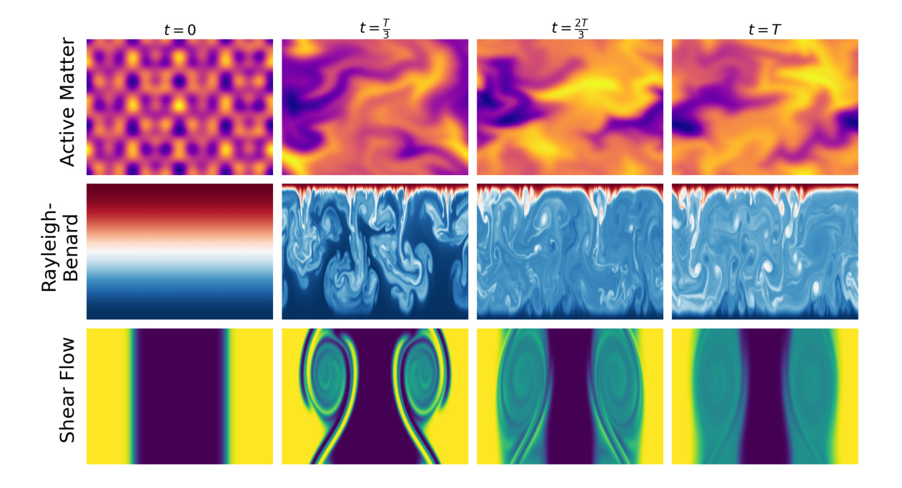
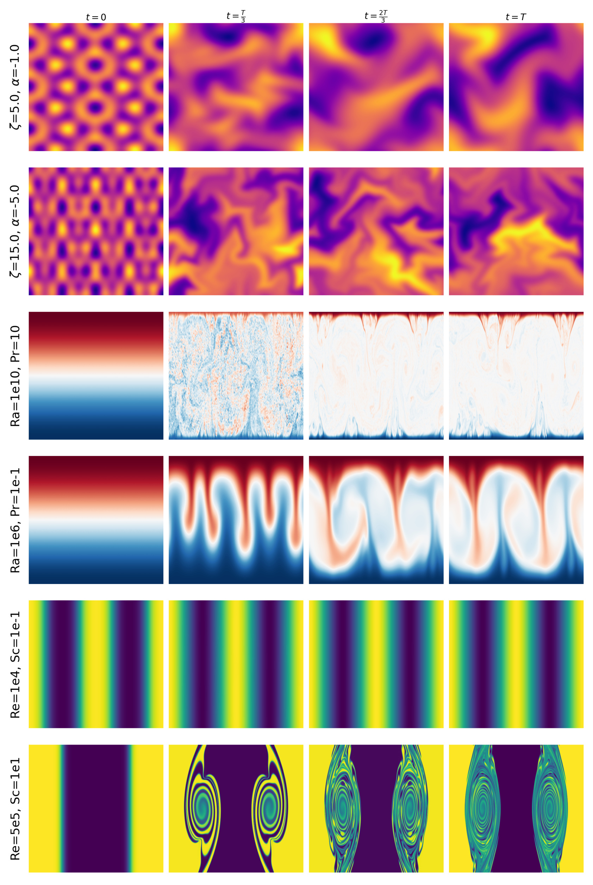

# Representation Learning for Spatiotemporal Physical Systems

> Published at ICLR 2026 Workshop on AI & PDE
> arXiv:2603.13227v1 [cs.LG] 13 Mar 2026

**Authors.** Helen Qu¹†, Rudy Morel¹, Michael McCabe¹⁴, Alberto Bietti¹, François Lanusse², Shirley Ho¹³⁴, Yann LeCun³

**The Polymathic AI Collaboration**

**Affiliations.**
¹ Flatiron Institute
² Université Paris-Saclay, Université Paris Cité, CEA, CNRS, AIM
³ New York University
⁴ Princeton University

† Contact: `hqu@flatironinstitute.org`
Code: <https://github.com/helenqu/physical-representation-learning>

---

## Abstract

Machine learning approaches to spatiotemporal physical systems have primarily focused on next-frame prediction, with the goal of learning an accurate emulator for the system's evolution in time. However, these emulators are computationally expensive to train and are subject to performance pitfalls, such as compounding errors during autoregressive rollout. In this work, we take a different perspective and look at scientific tasks further downstream of predicting the next frame, such as estimation of a system's governing physical parameters. Accuracy on these tasks offers a uniquely quantifiable glimpse into the physical relevance of the representations of these models. We evaluate the effectiveness of general-purpose self-supervised methods in learning physics-grounded representations that are useful for downstream scientific tasks. Surprisingly, we find that not all methods designed for physical modeling outperform generic self-supervised learning methods on these tasks, and methods that learn in the latent space (e.g., joint embedding predictive architectures, or JEPAs) outperform those optimizing pixel-level prediction objectives.

---

## 1. Introduction

Understanding and forecasting of physical systems is a challenging problem with applications ranging from biological development to astrophysical phenomena (Maddu et al., 2024; Morel et al., 2025b). Many applications of machine learning in this space explore autoregressive surrogate modeling, which aims to learn frame-by-frame, pixel-by-pixel emulators of computationally expensive numerical simulations (e.g., McCabe et al., 2023; Herde et al., 2024; McCabe et al., 2025). However, these full-field prediction models are computationally expensive to train and may not be best suited for higher-level downstream tasks of scientific interest, such as parameter estimation or qualitative prediction (e.g., whether the system remains laminar or becomes turbulent). Relatively little attention has been paid to understanding which learning paradigms optimally learn and preserve physically meaningful information.

In this work, we investigate the efficacy of self-supervised learning paradigms for tackling scientifically meaningful tasks in spatiotemporal physical systems. We compare traditional masked autoencoding and joint embedding predictive architectures (JEPAs, LeCun, 2022; Assran et al., 2023; Bardes et al., 2024; Assran et al., 2025) with methods developed for physical modeling and inference on three representative physical systems (active matter, shear flow, and Rayleigh-Bénard convection; see Figure 1). Unlike traditional self-supervised methods, JEPAs are trained to predict in the model's learned latent space rather than the granular, low-level space of pixel values. We probe the models' understanding of these systems through physical parameter estimation, a quantifiable proxy for physical information, and demonstrate that embeddings learned by latent prediction models consistently outperform pixel-based self-supervised methods.

> **Figure 1.** Example trajectories from the physical systems in our evaluation.

---

## 2. Setup

We introduce the self-supervised representation learning methods, physical modeling baselines, and fine-tuning procedure used in this work.

### 2.1 Representation Learning Frameworks

**Joint Embedding Predictive Architectures.** We introduce a latent feature prediction model based on joint embedding predictive architectures (JEPA) optimized for dynamics. JEPAs minimize error in the space of representations, while pixel reconstruction models learn low-level detail in the visual input that may not be helpful for understanding the simple underlying dynamics. Our JEPA formulation posits that for a sample with $T$ temporal steps $x_{0:T}$, aligning the representation of $x_{t:t+k}$ with the representation of $x_{t+k:t+2k}$ (i.e. predicting the representation of the next sequence of $k$ frames from a context sequence of $k$ frames) will produce flexible embeddings that carry high-level information about the visual content. Formally, we aim to learn an encoder $f : \mathcal{X} \to \mathcal{Z}$ and predictor $g : \mathcal{Z} \to \mathcal{Z}$ that minimizes $\mathcal{L}(f, g) = \mathbb{E}_{x_i, x_{i+1} \sim \mathcal{X}}[\ell_{\mathrm{VICReg}}(g(f(x_i)), f(x_{i+1}))]$, where $\ell_{\mathrm{VICReg}}$ is defined following Bardes et al. (2021) to prevent mode collapse:

$$
\ell_{\mathrm{VICReg}}(z_i, z_{i+1}) = \lambda\, s(z_i, z_{i+1}) + \mu\, [v(z_i) + v(z_{i+1})] + \nu\, [c(z_i) + c(z_{i+1})] \tag{Eq.1}
$$

Here, $s(z_i, z_{i+1}) = \frac{1}{n} \sum_i \|z_{i+1} - z_i\|_2^2$ is the invariance criterion, $v(z) = \frac{1}{d} \sum_{j=1}^{d} \max(0, 1 - \sqrt{\mathrm{var}(z) + \epsilon})$ is the variance regularization term, and $c(z) = \frac{1}{d} \sum_{i \neq j} C_{ij}(z)^2$ is the covariance regularization term, where $C$ is the covariance matrix of $z$. $\lambda, \mu, \nu$ are hyperparameters controlling the importance of each term in the loss, and $d$ is the batch size.

**Masked autoencoding.** Autoencoders aim to learn an encoder-decoder pair $f : \mathcal{X} \to \mathcal{Z}, g : \mathcal{Z} \to \mathcal{X}$ where $\mathcal{Z}$ is the abstract representation space of the model, that minimizes pixel-level reconstruction error. We implement masked autoencoding in this work, where reconstruction error is computed over masked regions $x(m), m \in \{0, 1\}^N$: $\mathcal{L}(f, g) = \mathbb{E}_{x \sim \mathcal{X}, m \sim \mathcal{M}}[(\hat{x}(m) - x(m))^2]$, where $\hat{x} = g(f(x))$. In practice, masked autoencoders have been extended to spatiotemporal data by enforcing temporal tube masking, i.e. all frames $x_{0:T}$ use the same spatial mask $m$. Autoencoding is a common paradigm for feature learning from large datasets.

### 2.2 Physical Modeling Baselines

Our baselines center their approaches on learning physical priors, either through data (in the style of autoregressive foundation models) or through architectural/training inductive biases (neural operator-style approaches).

**Autoregressive foundation models.** Foundation models for physics, often implemented as pixel-level autoregressive models for spatiotemporal systems, learn to predict the pixel values of the frame at the next timestep $x_{t+1}$ given a context window of the previous $n$ frames, $x_{t-n:t}$. These are often called "surrogate models" due to their potential to replace the computationally expensive procedure of numerically solving for the next step of the spatiotemporal system (e.g., through PDE numerical solvers).

**In-context operator learning.** In-context operator learning models combine in-context transformers with the inductive bias of neural operators. Rather than learning a single operator across all trajectories, that are described by multiple physics, this approach infers a trajectory-specific operator network $f_\theta$ that is, an evolution rule, from a short context window and evolves it forward in time using explicit integration.

### 2.3 Fine-tuning

Fine-tuning learns a prediction head $h : \mathcal{Z} \to \mathcal{Y}$ on embeddings from the pretrained model to optimize $\mathcal{L}(h) = \mathbb{E}_{x \sim \mathcal{X}, y \sim p^*(\cdot \mid x)}[\ell_{\mathrm{ft}}(h(f(x)), y)]$, where $\ell_{\mathrm{ft}} : \mathcal{Y} \times \mathcal{Y} \to \mathbb{R}$ is implemented as squared error loss for regression.

---

## 3. Evaluating Representations with Physical Systems

We evaluate on the task of physical parameter prediction: the minimum prediction error achievable on physical parameters underlying each system. Intuitively, these parameters govern the time evolution of these systems, so low inference error indicates better understanding of the underlying physical process. We show some examples of how evolution depends on the values of these parameters in Figure 2. We evaluate across three PDE-governed spatiotemporal systems drawn from The Well (Ohana et al., 2025).

**Active matter.** Active matter systems are a collection of agents that convert chemical energy into mechanical work, causing emergent, system-wide patterns and collective dynamics. This dataset models the dynamics of $N$ rodlike active particles immersed in a Stokes fluid, which is modeled by kinetic theory. The system parameters of interest are $\alpha$, the active dipole strength, and $\zeta$, the strength of particle alignment through steric interactions.

**Rayleigh-Bénard convection.** This system describes the behavior of a horizontal fluid layer heated from below and cooled from above, forming Bénard convective cells due to the temperature gradient. The system parameters of interest parameterize properties of the fluid layer: the Rayleigh number $\nu$, the ratio of buoyancy forces to viscous forces, and the Prandtl number $\kappa$, the ratio of momentum diffusivity to thermal diffusivity.

**Shear flow.** Shear flow describes the boundary between layers of fluid (modeled by incompressible Navier-Stokes) moving parallel to each other at different velocities, potentially leading to vortex/eddy formation and turbulence. The system parameters of interest are the Reynolds number, the ratio between inertial and viscous forces in the fluid, and the Schmidt number, the ratio of momentum diffusivity to mass diffusivity, of the fluids.

---

## 4. Experiments

We use our physical dynamics testbed to compare the representations learned by our latent dynamics JEPA model with those of a masked autoencoder trained with masked pixel prediction objective, which we implement in practice as a VideoMAE ViT-tiny/16 (Tong et al., 2022). We additionally compare to two baselines: the operator meta-learning framework DISCO (Morel et al., 2025a) and the autoregressive model MPP (McCabe et al., 2024).

**Pretraining procedure.** We implement the JEPA encoder as a downsampling CNN following ConvNeXt (Liu et al., 2022), while the predictor is a CNN with an inverse bottleneck in the channel dimension. We pretrain VideoMAE from scratch following Tong et al. (2022). We pretrain separate JEPA and VideoMAE models on each physics dataset individually to encourage representations optimized for each system's unique dynamics. MPP is intended as a foundation model approach, so we use the published pretrained weights for their AViT-tiny model. Finally, we use a DISCO model pretrained on The Well following Morel et al. (2025a). Further implementation details are provided in Appendix B.

> **Table 1.** Physical parameter prediction MSE of the self-supervised (top 2 rows) and physical modeling (bottom 2 rows) methods after fine-tuning. JEPA outperforms VideoMAE on physical parameter estimation, and JEPA prediction error approaches that of DISCO, the best physical modeling method we tested.

| Method | active matter | shear flow | Rayleigh-Bénard convection |
|---|---:|---:|---:|
| **JEPA** | **0.079** | **0.38** | **0.13** |
| VideoMAE | 0.160 | 0.67 | 0.18 |
| **DISCO** | **0.057** | **0.13** | **0.01** |
| MPP (full finetuning) | 0.230 | 0.59 | 0.08 |

> **Table 2.** Physical parameter prediction MSE with increasing fine-tuning dataset size, tested on the shear flow parameter prediction task. JEPA exhibits better data scaling behavior compared to VideoMAE.

| Method | 10% | 50% | 100% |
|---|---:|---:|---:|
| **JEPA** | **0.57** | **0.40** | **0.38** |
| VideoMAE | 0.98 | 0.75 | 0.67 |

**Fine-tuning procedure.** For VideoMAE, JEPA, and DISCO models, we follow the procedure outlined in Bardes et al. (2024) to fine-tune attentive probes for 100 epochs on top of the frozen encoders. We keep the encoder weights frozen to evaluate the physically meaningful information each model was able to learn without explicit supervision. We perform end-to-end fine-tuning of MPP following McCabe et al. (2023), since unlike the other models, the MPP pretraining did not include the active matter, shear flow, and Rayleigh-Bénard datasets. As described in Section 3, we report the averaged MSE on parameters $\alpha$ and $\zeta$ for active matter, Reynolds and Schmidt numbers for shear flow, and Rayleigh and Prandtl numbers for Rayleigh-Bénard.

**JEPAs outperform MAE in parameter estimation.** We show results for parameter estimation in Table 1 in terms of mean-squared-error loss (MSE, lower is better). JEPA improves substantially on VideoMAE results across the board. We find a 51% relative improvement on active matter (0.16 → 0.08), 43% on shear flow (0.67 → 0.38), and 28% (0.18 → 0.13) on Rayleigh-Bénard.

**Comparison with methods for physical modeling.** We are interested in comparing our generic representation learning methods against the goalposts of physics models like DISCO and MPP. We find that, there is large variance in the efficacy of using these methods with representation learning recipes. Fine-tuning from frozen DISCO latent representations yield excellent parameter prediction results, while MPP struggles despite end-to-end fine-tuning. This is consistent with McCabe et al. (2023, Table 9), and also consistent with results from the language modeling community demonstrating that autoregressive modeling approaches generally underperform encoder-only approaches on non-generative tasks (e.g., Devlin et al., 2018; Raffel et al., 2020). It is also interesting to note the variations between the methods for certain systems/tasks. For example, DISCO and JEPA perform very similarly (MSE of 0.057 and 0.079, respectively) on the active matter dataset, while differing by an order of magnitude (0.01 and 0.13) on Rayleigh-Bénard. However, VideoMAE closes the gap with JEPA most effectively on Rayleigh-Bénard (0.13 vs. 0.18). Finally, we note that DISCO and JEPA are both latent prediction models, while MPP and VideoMAE are pixel-level prediction models, and our results show that DISCO and JEPA are the two best performing models for their respective classes.

**JEPA exhibits desirable scaling behavior for fine-tuning data.** We compare the sample efficiency of JEPA and VideoMAE at fine-tuning time in Table 2. We show using the shear flow parameter estimation task that with just 50% of the available fine-tuning data (16k examples), JEPA attains an MSE loss of 0.4 (95% of the best performance, 0.38). VideoMAE, however, exhibits a larger drop between 50% and 100% (0.75, which is 89% of the best performance, 0.67). Moreover, even with 10% of the fine-tuning data, JEPA outperforms VideoMAE's best performance with 100% of the data (0.57 compared to 0.67).

---

## 5. Conclusion

We investigated the ability of general-purpose self-supervised methods to learn physically meaningful information in spatiotemporal systems by evaluating their ability to recover governing parameters across three PDE benchmarks. Our results show that latent prediction objectives consistently produce representations that are more physically informative and more sample-efficient to fine-tune compared to pixel-level reconstruction and autoregressive models. These findings highlight the value of disentangling the physical relevance of learned representations from generative fidelity and suggest that alternatives to autoregressive surrogate modeling, such as latent-space predictive learning, could be a promising foundation for scientific machine learning.

---

## Acknowledgments

We thank the Scientific Computing Core at the Flatiron Institute, a division of the Simons Foundation, for providing computational resources and support. We also acknowledge Jeremy Cohen, Tanya Marwah, Sebastian Wagner-Carena, the Polymathic AI team, and our anonymous reviewers for helpful discussions and comments. Finally, Polymathic AI gratefully acknowledges funding from the Simons Foundation and Schmidt Sciences.

---

## A. Related Work

**Machine learning for physical systems.** Predicting physical dynamics has motivated a wide range of approaches (Sirignano & Spiliopoulos, 2018; Yu et al., 2018; Han et al., 2018; Bar & Sochen, 2019; Zang et al., 2020) with varying amounts of assumed knowledge about the governing equations. More recently, there has been growing interest in developing foundation models for dynamical systems, training on a large corpus of physical data and adapting the network to various downstream tasks through fine-tuning (e.g., McCabe et al., 2023; Herde et al., 2024; Nguyen et al., 2025; Sun et al., 2025). However, most of these approaches focus on modeling the dynamics while very little work has been done with an eye towards concrete downstream scientific tasks. The most relevant work to ours is Mialon et al. (2023), which introduces a Lie symmetries-based augmentation procedure for self-supervised representation learning on physical systems. In our work, we explore the efficacy of various self-supervised as well as physical modeling objectives through the lens of representation learning.

**Self-supervised learning.** Self-supervised learning objectives allow models to learn generally useful representations from data without the need for task-specific human annotations (Balestriero et al., 2023). This is done through the introduction of a pretext task, e.g., next token prediction in modern language models (e.g., OpenAI, 2023; Gemini Team et al., 2023; Grattafiori et al., 2024), masked autoencoding (He et al., 2021; Devlin et al., 2018), contrastive methods (Chen et al., 2020a;b; Caron et al., 2020), self-distillation (Caron et al., 2021), and joint embedding architectures (Assran et al., 2023; Bardes et al., 2024; Assran et al., 2025). However, these are primarily evaluated with human-centric "natural" data (e.g., ImageNet (Deng et al., 2009)). This work investigates general-purpose self-supervised learning frameworks in the context of scientific data, specifically in a setting for which ground-truth governing equations and parameters are known. This unique testbed gives a new perspective on the representations learned by these methods.

---

## B. Implementation Details

All encoders are given input sequences of $l \times w \times d \times t$, where $l, w$ are the spatial dimensions of the image, $d$ is the number of physical fields (e.g., buoyancy, pressure, etc.) and $t = 16$ context frames.

The JEPA encoder and predictor architectures are 3D convolutional neural networks. The final encoder output is $l/16 \times w/16 \times 128$. We use the "small" VideoMAE ViT architecture with patch size 16 provided in their codebase, with encoder output $l/16 \times w/16 \times t/2 \times 384$. We use the output of DISCO's hypernetwork as embeddings, which are $1 \times 384$, and MPP's embeddings are $l/16 \times w/16 \times 192$.

JEPA and VideoMAE are pretrained for 6 epochs, and all models are finetuned for 100 epochs. We use the AdamW optimizer with a cosine learning rate schedule for all training/fine-tuning.

Empirically, we find good performance by choosing hyperparameters $\lambda = 2, \mu = 40, \nu = 2$ for the VICReg-style loss function used to pretrain the JEPA models.

> **Figure 2.** Different values for the physical parameters, e.g., Rayleigh (Ra) and Prandtl (Pr) numbers for Rayleigh-Bénard, lead each system to evolve very differently.

---

## References

- **Assran et al., 2023.** Mahmoud Assran, Quentin Duval, Ishan Misra, Piotr Bojanowski, Pascal Vincent, Michael Rabbat, Yann LeCun, and Nicolas Ballas. *Self-supervised learning from images with a joint-embedding predictive architecture.* In Proceedings of the IEEE/CVF Conference on Computer Vision and Pattern Recognition, pp. 15619–15629, 2023.
- **Assran et al., 2025.** Mido Assran, Adrien Bardes, David Fan, Quentin Garrido, Russell Howes, Matthew Muckley, Ammar Rizvi, Claire Roberts, Koustuv Sinha, Artem Zholus, et al. *V-jepa 2: Self-supervised video models enable understanding, prediction and planning.* arXiv preprint arXiv:2506.09985, 2025.
- **Balestriero et al., 2023.** Randall Balestriero, Mark Ibrahim, Vlad Sobal, Ari Morcos, Shashank Shekhar, Tom Goldstein, Florian Bordes, Adrien Bardes, Gregoire Mialon, Yuandong Tian, Avi Schwarzschild, Andrew Gordon Wilson, Jonas Geiping, Quentin Garrido, Pierre Fernandez, Amir Bar, Hamed Pirsiavash, Yann LeCun, and Micah Goldblum. *A cookbook of self-supervised learning.* arXiv, 2023.
- **Bar & Sochen, 2019.** Leah Bar and Nir Sochen. *Unsupervised deep learning algorithm for pde-based forward and inverse problems.* arXiv preprint arXiv:1904.05417, 2019.
- **Bardes et al., 2021.** Adrien Bardes, Jean Ponce, and Yann LeCun. *VICReg: Variance-invariance-covariance regularization for self-supervised learning.* arXiv preprint arXiv:2105.04906, 2021.
- **Bardes et al., 2024.** Adrien Bardes, Quentin Garrido, Jean Ponce, Xinlei Chen, Michael Rabbat, Yann LeCun, Mahmoud Assran, and Nicolas Ballas. *Revisiting feature prediction for learning visual representations from video.* arXiv preprint arXiv:2404.08471, 2024.
- **Caron et al., 2020.** Mathilde Caron, Ishan Misra, Julien Mairal, Priya Goyal, Piotr Bojanowski, and Armand Joulin. *Unsupervised learning of visual features by contrasting cluster assignments.* In Advances in Neural Information Processing Systems (NeurIPS), volume 33, pp. 9912–9924, 2020.
- **Caron et al., 2021.** Mathilde Caron, Hugo Touvron, Ishan Misra, Herve Jegou, Julien Mairal, Piotr Bojanowski, and Armand Joulin. *Emerging properties in self-supervised vision transformers.* In International Conference on Computer Vision (ICCV), 2021.
- **Chen et al., 2020a.** Ting Chen, Simon Kornblith, Mohammad Norouzi, and Geoffrey Hinton. *A simple framework for contrastive learning of visual representations.* In International Conference on Machine Learning (ICML), pp. 1597–1607, 2020a.
- **Chen et al., 2020b.** Xinlei Chen, Haoqi Fan, Ross B. Girshick, and Kaiming He. *Improved baselines with momentum contrastive learning.* arXiv, 2020b.
- **Deng et al., 2009.** Jia Deng, Wei Dong, Richard Socher, Li-Jia Li, Kai Li, and Li Fei-Fei. *ImageNet: A large-scale hierarchical image database.* In Computer Vision and Pattern Recognition (CVPR), pp. 248–255, 2009.
- **Devlin et al., 2018.** Jacob Devlin, Ming-Wei Chang, Kenton Lee, and Kristina Toutanova. *BERT: Pre-training of deep bidirectional transformers for language understanding.* arXiv preprint arXiv:1810.04805, 2018.
- **Gemini Team et al., 2023.** Gemini Team, Rohan Anil, Sebastian Borgeaud, Jean-Baptiste Alayrac, Jiahui Yu, Radu Soricut, Johan Schalkwyk, Andrew M Dai, Anja Hauth, Katie Millican, et al. *Gemini: a family of highly capable multimodal models.* arXiv preprint arXiv:2312.11805, 2023.
- **Grattafiori et al., 2024.** Aaron Grattafiori, Abhimanyu Dubey, Abhinav Jauhri, Abhinav Pandey, Abhishek Kadian, Ahmad Al-Dahle, Aiesha Letman, Akhil Mathur, Alan Schelten, Alex Vaughan, Amy Yang, Angela Fan, Anirudh Goyal, Anthony Hartshorn, Aobo Yang, et al. *The llama 3 herd of models*, 2024. URL <https://arxiv.org/abs/2407.21783>.
- **Han et al., 2018.** Jiequn Han, Arnulf Jentzen, and Weinan E. *Solving high-dimensional partial differential equations using deep learning.* Proceedings of the National Academy of Sciences, 115(34):8505–8510, 2018.
- **He et al., 2021.** Kaiming He, Xinlei Chen, Saining Xie, Yanghao Li, Piotr Dollár, and Ross Girshick. *Masked autoencoders are scalable vision learners*, 2021.
- **Herde et al., 2024.** Maximilian Herde, Bogdan Raonic, Tobias Rohner, Roger Käppeli, Roberto Molinaro, Emmanuel de Bézenac, and Siddhartha Mishra. *Poseidon: Efficient foundation models for pdes*, 2024.
- **LeCun, 2022.** Yann LeCun. *A path towards autonomous machine intelligence version 0.9.2, 2022-06-27.* Open Review, 62(1):1–62, 2022.
- **Liu et al., 2022.** Zhuang Liu, Hanzi Mao, Chao-Yuan Wu, Christoph Feichtenhofer, Trevor Darrell, and Saining Xie. *A ConvNet for the 2020s*, 2022.
- **Maddu et al., 2024.** Suryanarayana Maddu, Scott Weady, and Michael J Shelley. *Learning fast, accurate, and stable closures of a kinetic theory of an active fluid.* Journal of Computational Physics, pp. 112869, 2024.
- **McCabe et al., 2023.** Michael McCabe, Bruno Régaldo-Saint Blancard, Liam Holden Parker, Ruben Ohana, Miles Cranmer, Alberto Bietti, Michael Eickenberg, Siavash Golkar, Geraud Krawezik, Francois Lanusse, et al. *Multiple physics pretraining for physical surrogate models.* arXiv preprint arXiv:2310.02994, 2023.
- **McCabe et al., 2024.** Michael McCabe, Bruno Régaldo-Saint Blancard, Liam Holden Parker, Ruben Ohana, Miles Cranmer, Alberto Bietti, Michael Eickenberg, Siavash Golkar, Geraud Krawezik, Francois Lanusse, Mariel Pettee, Tiberiu Tesileanu, Kyunghyun Cho, and Shirley Ho. *Multiple physics pretraining for spatiotemporal surrogate models.* In The Thirty-eighth Annual Conference on Neural Information Processing Systems, 2024. URL <https://openreview.net/forum?id=DKSI3bULiZ>.
- **McCabe et al., 2025.** Michael McCabe, Payel Mukhopadhyay, Tanya Marwah, Bruno Regaldo-Saint Blancard, Francois Rozet, Cristiana Diaconu, Lucas Meyer, Kaze WK Wong, Hadi Sotoudeh, Alberto Bietti, et al. *Walrus: A cross-domain foundation model for continuum dynamics.* arXiv preprint arXiv:2511.15684, 2025.
- **Mialon et al., 2023.** Grégoire Mialon, Quentin Garrido, Hannah Lawrence, Danyal Rehman, Yann LeCun, and Bobak Kiani. *Self-supervised learning with lie symmetries for partial differential equations.* Advances in Neural Information Processing Systems, 36:28973–29004, 2023.
- **Morel et al., 2025a.** Rudy Morel, Jiequn Han, and Edouard Oyallon. *DISCO: learning to discover an evolution operator for multi-physics-agnostic prediction*, 2025a. URL <https://arxiv.org/abs/2504.19496>.
- **Morel et al., 2025b.** Rudy Morel, Francesco Pio Ramunno, Jeff Shen, Alberto Bietti, Kyunghyun Cho, Miles Cranmer, Siavash Golkar, OLEXANDR GUGNIN, Geraud Krawezik, Tanya Marwah, et al. *Predicting partially observable dynamical systems via diffusion models with a multiscale inference scheme.* In The Thirty-ninth Annual Conference on Neural Information Processing Systems, 2025b.
- **Nguyen et al., 2025.** Tung Nguyen, Arsh Koneru, Shufan Li, and Aditya Grover. *PhysiX: A foundation model for physics simulations*, 2025. URL <https://arxiv.org/abs/2506.17774>.
- **Ohana et al., 2025.** Ruben Ohana, Michael McCabe, Lucas Meyer, Rudy Morel, Fruzsina J. Agocs, Miguel Beneitez, Marsha Berger, Blakesley Burkhart, Keaton Burns, Stuart B. Dalziel, Drummond B. Fielding, Daniel Fortunato, Jared A. Goldberg, Keiya Hirashima, Yan-Fei Jiang, Rich R. Kerswell, Suryanarayana Maddu, Jonah Miller, Payel Mukhopadhyay, Stefan S. Nixon, Jeff Shen, Romain Watteaux, Bruno Régaldo-Saint Blancard, François Rozet, Liam H. Parker, Miles Cranmer, and Shirley Ho. *The well: a large-scale collection of diverse physics simulations for machine learning*, 2025. URL <https://arxiv.org/abs/2412.00568>.
- **OpenAI, 2023.** OpenAI. *GPT-4 technical report.* arXiv preprint arXiv:2303.08774, 2023.
- **Raffel et al., 2020.** Colin Raffel, Noam Shazeer, Adam Roberts, Katherine Lee, Sharan Narang, Michael Matena, Yanqi Zhou, Wei Li, and Peter J Liu. *Exploring the limits of transfer learning with a unified text-to-text transformer.* Journal of Machine Learning Research, 21(140):1–67, 2020.
- **Sirignano & Spiliopoulos, 2018.** Justin Sirignano and Konstantinos Spiliopoulos. *DGM: A deep learning algorithm for solving partial differential equations.* Journal of Computational Physics, 375:1339–1364, 2018.
- **Sun et al., 2025.** Jingmin Sun, Yuxuan Liu, Zecheng Zhang, and Hayden Schaeffer. *Towards a foundation model for partial differential equations: Multi-operator learning and extrapolation*, 2025. URL <https://arxiv.org/abs/2404.12355>.
- **Tong et al., 2022.** Zhan Tong, Yibing Song, Jue Wang, and Limin Wang. *VideoMAE: Masked autoencoders are data-efficient learners for self-supervised video pre-training.* In Alice H. Oh, Alekh Agarwal, Danielle Belgrave, and Kyunghyun Cho (eds.), Advances in Neural Information Processing Systems, 2022. URL <https://openreview.net/forum?id=AhccnBXSne>.
- **Yu et al., 2018.** Bing Yu et al. *The deep ritz method: a deep learning-based numerical algorithm for solving variational problems.* Communications in Mathematics and Statistics, 6(1):1–12, 2018.
- **Zang et al., 2020.** Yaohua Zang, Gang Bao, Xiaojing Ye, and Haomin Zhou. *Weak adversarial networks for high-dimensional partial differential equations.* Journal of Computational Physics, 411:109409, 2020.
