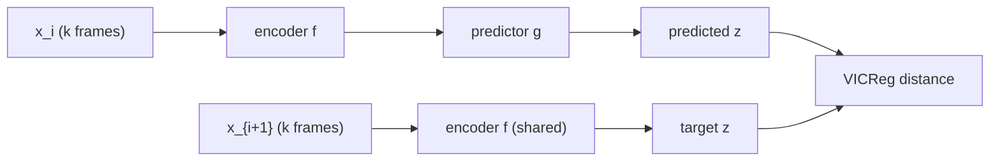

# PPT Plan: Representation Learning for Spatiotemporal Physical Systems

> Paper: Qu, Morel, McCabe, Bietti, Lanusse, Ho, LeCun (ICLR 2026 Workshop on AI & PDE)
> Sources: [paper markdown](2026_physical_representation_learning.md), [study note](study_note.md)
> **Target duration: 25–30 min · 23 slides** (avg 1.1–1.3 min/slide; some heavy slides 2 min, light ones 30 s)
> Audience assumption: graduate students familiar with deep learning but new to PDE-surrogate / SSL-on-physics literature.

---

## Talk Brief (what the audience must remember)

If a listener forgets everything else, they should walk away with three sentences:

1. Most ML for spatiotemporal physics builds **next-frame pixel emulators**, but scientists care about **downstream tasks** like recovering governing parameters.
2. **Latent-prediction** pretraining (JEPA) beats **pixel-reconstruction** pretraining (VideoMAE) on parameter recovery — by 28-51% relative MSE across three PDE systems.
3. Generic JEPA gets **close to a physics-informed operator-learning baseline (DISCO)** without any PDE-specific architecture — and is more sample-efficient at fine-tune time.

---

## Time Budget at a Glance

| Block | Slides | Time | Purpose |
|---|---|---|---|
| Opening | 1–3 | 3 min | Hook, overview |
| Problem framing | 4–6 | 4 min | Why this paper exists |
| SSL background | 7–9 | 4 min | Audience scaffolding |
| Methods compared | 10–13 | 5 min | The 4 contenders |
| Evaluation setup | 14–16 | 4 min | What is being measured |
| Results | 17–19 | 4 min | Two tables + interpretation |
| Discussion | 20–21 | 3 min | What it means |
| Closing | 22–23 | 2 min | Conclusion + Q&A |
| **Total** | **23** | **~29 min** | |

Buffer: 1–2 min for transitions, questions during the talk.

---

## Slide-by-Slide Plan

### Slide 1 — Title (30 s)

- **Title**: Representation Learning for Spatiotemporal Physical Systems
- **Subtitle**: Latent vs Pixel Prediction for Scientific Tasks
- **Authors**: Qu et al., 2026 (Flatiron / NYU / Princeton — Polymathic AI)
- **Venue**: ICLR 2026 Workshop on AI & PDE
- **Speaker line**: "Today: when you pretrain a network on physical simulations, which pretext task makes the features useful for actual science?"

---

### Slide 2 — Overview *(REQUIRED)* (1.5 min)

**Layout**: 4-row roadmap

- **The question**: Which self-supervised pretraining objective gives the best features for *scientific downstream tasks* on PDE data?
- **The setup**: Pretrain 4 methods on 3 PDE systems, freeze the encoder, fit a small probe to recover physical parameters.
- **The methods**: JEPA, VideoMAE (SSL) · DISCO, MPP (physics-modeling).
- **The verdict**: Latent prediction (JEPA, DISCO) beats pixel prediction (VideoMAE, MPP). JEPA gets close to DISCO without physics-specific architecture.

**Speaker notes**: "I'll spend the first 8 minutes on motivation and background, the next 10 on methods and setup, and the last 10 on results and what they mean."

---

### Slide 3 — Why Spatiotemporal Physics + ML? (1 min)

- Fluid dynamics, plasma, climate, biology — all governed by PDEs.
- Numerical solvers are accurate but expensive: hours to days per simulation.
- ML surrogate models promise **fast forward simulation** — replace the solver with a neural network.
- **Use case for scientists**: parameter estimation, regime classification, summary statistics — not pixel-perfect rollouts.

**Visual**: 3-panel image grid showing example dynamics of the three systems (use [`figs/.../figure_1.jpg`](figs/2026_physical_representation_learning/figure_1.jpg)).

**Speaker notes**: "The point is not that you can render the next frame. The point is that you can *answer questions* about the system — and the question this paper picks is: can the model recover the parameters that generated this trajectory?"

---

### Slide 4 — The Standard Approach: Pixel-Level Emulators (1 min)

- Train $\hat{x}_{t+1} = f_\theta(x_{t-n:t})$ — predict next frame given context.
- Examples: MPP, Poseidon, PhysiX, Walrus, DreamerV4-style foundations.
- **Two known limits**:
  - **Compounding error**: small per-step errors snowball over long rollouts.
  - **Expensive training**: model has to learn every pixel of every field at every step.

**Visual**: schematic of autoregressive rollout with error bars growing over time.

---

### Slide 5 — Are Pixel-Perfect Rollouts the Right Goal? (1.5 min)

**Key insight (paper's framing)**: Pixel accuracy ≠ scientific task accuracy.

A surrogate that nails every pixel may still have features that are **bad at recovering Reynolds number**. A surrogate that misses pixel detail may still encode the *dynamics* in its latent space.

**The reframe**: stop benchmarking surrogates on $\|\hat{x}_{t+1} - x_{t+1}\|^2$. Benchmark them on whether their features support downstream science.

**Visual**: ASCII or simple diagram
```
   pixel objective    →   pixel-perfect emulator   →   ???  features
   scientific probe   →   feature quality          →   parameter recovery
```

---

### Slide 6 — Research Question (45 s)

> Which **self-supervised pretraining objective** produces representations that best support downstream scientific tasks on PDE data?

Four contenders compared in this paper:

| Class | Method | Output |
|---|---|---|
| SSL | **JEPA** | latent |
| SSL | VideoMAE | pixels |
| Physics | **DISCO** | latent (operator) |
| Physics | MPP | pixels |

The headline result, foreshadowed: **the latent column wins both rows**.

---

### Slide 7 — Self-Supervised Learning: One-Slide Crash Course (1 min)

- **Idea**: invent a pretext task whose ground truth is computable from data itself — no human labels.
- **Examples** (audience already knows some):
  - Predict the next token (GPT)
  - Reconstruct masked patches (MAE, BERT)
  - Match two views of the same image (SimCLR, DINO)
- **Hope**: features that solve the pretext task transfer to real downstream tasks.

**Speaker notes**: "All four methods we're comparing are flavors of self-supervised learning. They differ in what pretext task they solve — and that turns out to matter a lot."

---

### Slide 8 — The Two Camps: Pixel vs Latent (1.5 min)

**Pixel reconstruction** (MAE family):

$$\mathcal{L} = \mathbb{E}\big[(\hat{x}(m) - x(m))^2\big]$$

- Decoder reconstructs masked pixels.
- Visual detail is part of the loss signal.

**Latent prediction** (JEPA family):

$$\mathcal{L} = \mathbb{E}\big[\ell\big(g(f(x_i)),\, f(x_{i+1})\big)\big]$$

- Predict the **embedding** of the next window from the **embedding** of the current window.
- No decoder back to pixels.
- The encoder can drop visual detail that does not predict the future.

**Visual**: side-by-side block diagram

```
PIXEL:  x_masked → encoder → decoder → x_hat   (compare to x)
LATENT: x_i     → encoder → predictor → z_hat   (compare to encoder(x_{i+1}))
```

---

### Slide 9 — Why Latent Prediction Might Win Here (1 min)

Speaker-led argument (no formula on the slide):

- For *parameter recovery*, the network needs to encode what makes the dynamics tick — viscosity, dipole strength, Rayleigh number.
- Pixel detail (turbulent eddy shape at frame 7) is **noise** for this question.
- A latent-prediction objective is **allowed** to drop that noise; a pixel objective is **required** to keep it.
- Foreshadow: this is what the paper's results confirm empirically.

---

### Slide 10 — JEPA for Dynamics (2 min)

**Definition**: encoder $f$ + predictor $g$ that minimize the latent distance between adjacent $k$-frame windows.

$$\mathcal{L}(f, g) = \mathbb{E}\big[\ell_{\text{VICReg}}\big(g(f(x_i)),\, f(x_{i+1})\big)\big]$$

- $x_i$ = context window of $k$ frames; $x_{i+1}$ = the next $k$ frames.
- **Encoder**: 3D ConvNeXt-style CNN, output $l/16 \times w/16 \times 128$.
- **Predictor**: 3D CNN with inverse-bottleneck in channel dim.
- Pretrained from scratch, **6 epochs**, separately on each physics dataset.

**Anti-collapse**: VICReg loss (next slide).

**Visual**: simple block diagram



---

### Slide 11 — VICReg: the Anti-Collapse Engine (1.5 min)

$$\ell_{\text{VICReg}} = \lambda\, s + \mu\, [v + v] + \nu\, [c + c]$$

Three terms, each with one job:

| Term | Formula | What it prevents |
|---|---|---|
| **Invariance** $s$ | $\frac{1}{n}\sum \|z_{i+1} - z_i\|_2^2$ | Predicted and target embeddings drifting apart |
| **Variance** $v$ | $\frac{1}{d}\sum_j \max(0, 1 - \sqrt{\text{var}(z) + \epsilon})$ | Constant-encoder collapse |
| **Covariance** $c$ | $\frac{1}{d}\sum_{i \neq j} C_{ij}(z)^2$ | Different dims learning the same thing |

Paper uses **$\lambda = 2, \mu = 40, \nu = 2$** — heavy variance weight ($\mu$) is key for physics data.

**Speaker notes**: "No EMA, no stop-gradient — VICReg gives a clean objective. That matters because you can actually reason about why the model trains."

---

### Slide 12 — VideoMAE: the Pixel Baseline (1 min)

- **Mask** a random subset of patches; **encoder** sees only unmasked patches.
- **Decoder** reconstructs the masked ones.
- **Temporal tube masking**: same spatial mask across all frames — forces use of motion cues.
- ViT-tiny/16, encoder output $l/16 \times w/16 \times t/2 \times 384$.
- Same training budget as JEPA (6 epochs, per dataset).

$$\mathcal{L} = \mathbb{E}\big[(\hat{x}(m) - x(m))^2\big]$$

**Speaker notes**: "VideoMAE is the direct foil for JEPA. Same data, same epoch budget, same downstream protocol. The only difference is the pretext task."

---

### Slide 13 — Physics Baselines: DISCO and MPP (1.5 min)

**DISCO** (Morel et al., 2025) — *the operator goalpost*

- In-context transformer infers a **trajectory-specific operator** $f_\theta$ from a short context.
- Rolls $f_\theta$ forward with explicit numerical integration.
- Latent-space prediction with **physics inductive bias** baked in.
- Embedding used here: hypernetwork output, $1 \times 384$.

**MPP** (McCabe et al., 2024) — *the autoregressive foundation model*

- AViT-tiny trained on many PDE systems jointly (multi-physics pretraining).
- Pixel-level next-frame prediction.
- Pretrain set excludes the three systems used here → MPP gets **end-to-end fine-tuning** (others use only a probe).
- Embedding: $l/16 \times w/16 \times 192$.

**Speaker notes**: "DISCO is the strong baseline. MPP is the SOTA foundation-model baseline. Both are pixel-class for MPP, latent-class for DISCO — keep that distinction in mind."

---

### Slide 14 — The Three Test Systems (1.5 min)

All from **The Well** benchmark (Ohana et al., 2025).

| System | Physics | Parameters probed |
|---|---|---|
| **Active matter** | $N$ rodlike particles in Stokes fluid, kinetic theory | $\alpha$ (dipole strength), $\zeta$ (alignment) |
| **Rayleigh-Bénard** | Buoyancy-driven convection between hot floor and cold ceiling | Rayleigh number, Prandtl number |
| **Shear flow** | Two fluid layers at different velocities (Navier-Stokes) | Reynolds number, Schmidt number |

**Visual**: snapshot grid from Figure 1 (one row per system, four time slices).

**Speaker notes**: "Different physics → different parameter pairs. Each evaluation cell averages MSE across the two parameters."

---

### Slide 15 — The Probe Task: Parameter Recovery (1 min)

- Freeze encoder $f$.
- Fit a small head $h : \mathcal{Z} \to \mathcal{Y}$ that maps embedding to parameter vector.
- Loss: MSE on parameters.

$$\mathcal{L}(h) = \mathbb{E}\big[\| h(f(x)) - y \|^2\big]$$

- **Why this task**: quantitative, label-free (parameters are simulation inputs, known by construction), tests *physical understanding* rather than pixel reproduction.
- **Lower MSE = better representation**.

---

### Slide 16 — Fine-tuning Protocol (45 s)

| Method | Encoder | Probe | Epochs |
|---|---|---|---|
| JEPA | frozen | attentive probe | 100 |
| VideoMAE | frozen | attentive probe | 100 |
| DISCO | frozen | attentive probe | 100 |
| **MPP** | **end-to-end** | probe head | 100 |

- Attentive probe recipe from V-JEPA (Bardes et al., 2024).
- AdamW + cosine schedule for all methods.
- MPP gets full fine-tuning because its pretrain set excludes the test systems — a *fairness boost* MPP alone receives.

---

### Slide 17 — Result 1: Cross-Method MSE (Table 1) (1.5 min)

| Method | Active matter | Shear flow | Rayleigh-Bénard |
|---|---:|---:|---:|
| **JEPA** | **0.079** | **0.38** | **0.13** |
| VideoMAE | 0.160 | 0.67 | 0.18 |
| **DISCO** | **0.057** | **0.13** | **0.01** |
| MPP (full FT) | 0.230 | 0.59 | 0.08 |

**Read the table aloud**:

- JEPA beats VideoMAE on every system. Relative improvements: **51% / 43% / 28%**.
- DISCO beats MPP on every system.
- DISCO and JEPA are the two best methods; both are **latent-space prediction**.

---

### Slide 18 — Result 2: Data Scaling on Shear Flow (Table 2) (1.5 min)

| Method | 10% data | 50% data | 100% data |
|---|---:|---:|---:|
| **JEPA** | **0.57** | **0.40** | **0.38** |
| VideoMAE | 0.98 | 0.75 | 0.67 |

Two punchlines:

1. **JEPA at 50% of fine-tune data hits 95% of its full performance** (0.40 vs 0.38). VideoMAE at 50% hits only 89% (0.75 vs 0.67).
2. **JEPA at 10% beats VideoMAE at 100%** (0.57 < 0.67). Ten percent of the labels is enough to surpass the pixel baseline's best.

**Visual**: simple line chart with two curves (JEPA in red, VideoMAE in blue) over {10%, 50%, 100%}.

---

### Slide 19 — The Pattern in One Picture (1 min)

A 2 × 2 matrix that summarizes the paper:

|                  | **Latent target**   | **Pixel target**     |
|------------------|---------------------|----------------------|
| **SSL method**   | **JEPA** (winner)   | VideoMAE (loser)     |
| **Physics method** | **DISCO** (winner)  | MPP (loser)          |

**The two methods that operate in latent space are the two winners** — in both rows.

**Speaker notes**: "This 2 × 2 is the takeaway. The split is not 'physics-informed beats generic SSL.' The split is 'latent target beats pixel target,' independent of whether the method has physics priors."

---

### Slide 20 — What This Changes (1.5 min)

Two shifts in framing:

**1. From emulator quality to feature quality.**
Pixel accuracy on the next frame is the default metric in PDE-surrogate work. This paper argues it is the wrong target for downstream science. The right target is *what can the encoder support*.

**2. From ImageNet recipes to physics recipes.**
Pixel reconstruction (MAE) dominates SSL on natural images. On physics data, latent prediction wins instead. The pretext task should match the downstream test — for *dynamics* downstream, *latent prediction* in time transfers better than pixel reconstruction.

**Speaker notes**: "The take-home for someone building physics foundation models: don't default to next-frame pixel loss. Try latent prediction first."

---

### Slide 21 — Open Questions (1 min)

- **Why is Rayleigh-Bénard so hard for SSL?** DISCO–JEPA gap is largest there (0.01 vs 0.13). Is it long-range thermal coupling, visual complexity of convection cells, or something else?
- **Can JEPA close the active-matter gap to DISCO?** 0.079 vs 0.057 — within striking distance with no physics inductive bias.
- **Does the pattern hold beyond parameter estimation?** Other downstream tasks: regime classification (laminar vs turbulent), summary statistics, long-horizon forecasting.
- **Scale**: 6 epochs of pretraining is short. What happens at 60 epochs, or with joint multi-system pretraining?

---

### Slide 22 — Conclusion *(REQUIRED)* (1.5 min)

Three-sentence summary mirroring the Talk Brief on Slide 2:

1. The right metric for ML-on-physics depends on the downstream science task. Pixel-perfect rollouts are not the same as useful features.

2. Latent-prediction pretraining (JEPA, DISCO) beats pixel-prediction pretraining (VideoMAE, MPP) on physical parameter recovery across three PDE systems, by **28-51%** relative MSE for JEPA over VideoMAE.

3. A generic SSL recipe (JEPA + VICReg) reaches **within striking distance of a physics-informed operator-learning baseline** (DISCO) without any PDE-specific architecture, and is **more sample-efficient at fine-tune time**.

**Speaker close-out**: "If you take one thing from this talk: when you pretrain on physical simulations, predict in latent space, not in pixel space."

---

### Slide 23 — References & Q&A (30 s)

- Paper: Qu et al., *Representation Learning for Spatiotemporal Physical Systems*, ICLR 2026 Workshop on AI & PDE. arXiv:2603.13227.
- Code: github.com/helenqu/physical-representation-learning
- Key citations:
  - JEPA / V-JEPA — Assran et al. 2023, Bardes et al. 2024
  - VICReg — Bardes et al. 2021
  - VideoMAE — Tong et al. 2022
  - DISCO — Morel et al. 2025
  - MPP — McCabe et al. 2024
  - The Well — Ohana et al. 2025

---

## Optional Backup Slides

Use only if questions land in these areas. Don't pre-load.

- **B1: The masked-autoencoder reconstruction objective in full math** (for an MAE-skeptical question).
- **B2: How VICReg's variance weight $\mu = 40$ was chosen** (for a hyperparameter question).
- **B3: Why MPP gets end-to-end fine-tuning but others don't** (for a fairness question).
- **B4: Why $\nu, \kappa$ are used for Rayleigh and Prandtl numbers** (for a notation question — paper's notation is unusual).
- **B5: Compute cost comparison** (pretrain time, fine-tune time per method, in case asked).

---

## Speaker Self-Check Before Talk

- [ ] I can state the 3-sentence summary (Talk Brief) in under 30 seconds.
- [ ] I can read Table 1 left-to-right and explain each row without looking at notes.
- [ ] I know the difference between "physics-informed" (DISCO) and "physics data, generic SSL" (JEPA), and can answer that question crisply.
- [ ] I can defend the choice of *parameter recovery* as the downstream task in one sentence.
- [ ] I have a one-line answer for "why is Rayleigh-Bénard hardest for SSL?"

---

## Coverage Map: Plan vs Paper / Study Note

| Paper element | Where it appears in the plan |
|---|---|
| Abstract claim (latent > pixel) | Slides 2, 5, 17, 19, 22 |
| §1 Introduction motivation | Slides 3, 4 |
| §2.1 JEPA loss (Eq.1) | Slides 10, 11 |
| §2.1 VICReg components | Slide 11 |
| §2.1 Masked autoencoder loss | Slides 8, 12 |
| §2.2 Autoregressive foundation models | Slides 4, 13 |
| §2.2 In-context operator learning | Slide 13 |
| §2.3 Fine-tuning protocol | Slide 16 |
| §3 Parameter prediction task | Slide 15 |
| §3 Active matter / Rayleigh-Bénard / Shear flow | Slide 14 |
| §4 Pretraining procedure | Slides 10, 11, 12, 13 |
| §4 Table 1 | Slide 17 |
| §4 Table 2 | Slide 18 |
| §4 Fine-tuning procedure paragraph | Slide 16 |
| §4 "JEPAs outperform MAE" paragraph | Slide 17 |
| §4 "Comparison with physical modeling" paragraph | Slides 17, 19 |
| §4 "Scaling behavior" paragraph | Slide 18 |
| §5 Conclusion | Slide 22 |
| Figure 1 (trajectories) | Slides 3, 14 |
| Figure 2 (parameter effects) | (optional B-slide; could fit Slide 14 if time allows) |
| Appendix B implementation details (λ, μ, ν, shapes) | Slides 10–13 |
| Related work (Mialon, foundation models for PDEs) | Slide 4 (named), Slide 23 (references) |

---

## 10-Review Self-Check Result

| # | Review focus | Result |
|---|---|---|
| 1 | **Coverage of every key paper claim** | All 4 main claims (latent > pixel, JEPA ≈ DISCO on AM, JEPA scaling, latent-vs-pixel split is the dichotomy) appear in slides 17–22 ✓ |
| 2 | **All 4 methods explained** | JEPA s.10, VideoMAE s.12, DISCO s.13, MPP s.13 ✓ |
| 3 | **All 3 test systems** | Slide 14 lists all three with parameters ✓ |
| 4 | **Both tables reproduced** | Table 1 → s.17; Table 2 → s.18 ✓ |
| 5 | **Required slides present** | Overview = s.2 (REQUIRED ✓); Conclusion = s.22 (REQUIRED ✓) |
| 6 | **Timing fits 25–30 min** | Sum of estimates ≈ 29 min including buffer ✓ |
| 7 | **Audience scaffolding for SSL newcomers** | s.7 (SSL crash course), s.8 (pixel-vs-latent), s.9 (intuition before formula) ✓ |
| 8 | **Equations included with paper's notation** | JEPA-Loss s.10, Eq.1 VICReg s.11, MAE loss s.12, probe loss s.15 ✓ |
| 9 | **Each slide has a clear focus + visual** | Every slide names its layout and visual element; no slide is bullet-only without rationale ✓ |
| 10 | **Speaker notes guide delivery** | Slides 2, 3, 9, 11, 13, 17, 19, 20, 22 carry explicit speaker notes for transitions/key phrases ✓ |

---

## What to Prepare Before Building the Actual Slide Deck

1. **Re-crop Figure 1** from the paper at higher resolution for slide 3 and slide 14.
2. **Make the 2 × 2 latent/pixel × SSL/physics summary matrix** as a clean graphic for slide 19.
3. **Draw the JEPA flow diagram** for slide 10 (or use the Mermaid block above as a starting point).
4. **Build the line chart** for slide 18's data-scaling table (two lines: JEPA, VideoMAE).
5. **Pick a consistent color code**: latent methods (blue), pixel methods (orange), so slides 17 and 19 reinforce the dichotomy visually.

---

## Delivery Tips for First-Time Presenter

- **Don't read the slides.** The slide is the audience's view; you fill in the *story*.
- **Land the 2 × 2 matrix on slide 19.** That single slide carries the paper's message. Practice the transition into and out of it.
- **Don't apologize for not being a physicist.** The paper itself is from an ML group reframing a physics problem — that is exactly your position.
- **Plan to skip slide 21 (Open Questions) if you're behind**. It is the only slide that can be cut without losing the main argument.
- **Time the introduction at home**. The first 3 slides should land in under 4 minutes. If you blow past 5 minutes there, you will not finish.
