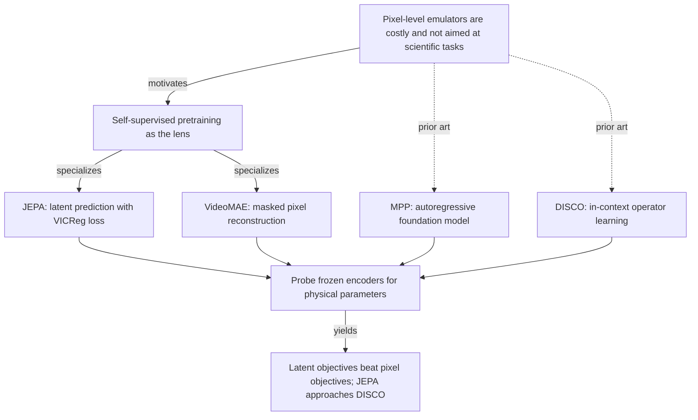
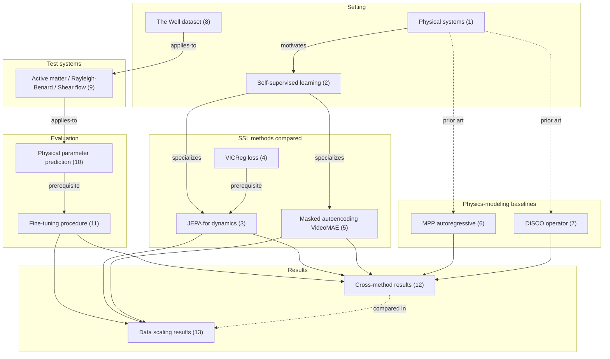

# Representation Learning for Spatiotemporal Physical Systems — Study Note

> Paper: *Representation Learning for Spatiotemporal Physical Systems* (arXiv:2603.13227v1, ICLR 2026 Workshop on AI & PDE)
> Authors: Helen Qu, Rudy Morel, Michael McCabe, Alberto Bietti, François Lanusse, Shirley Ho, Yann LeCun
> Affiliations: Flatiron Institute, Paris-Saclay/Paris Cité/CEA/CNRS/AIM, NYU, Princeton — The Polymathic AI Collaboration
> Source archive: [2026_physical_representation_learning.md](2026_physical_representation_learning.md) · Code: [helenqu/physical-representation-learning](https://github.com/helenqu/physical-representation-learning)

This note organizes every key concept in the paper as a mind-map.
Each concept is broken down into four facets:

- **Definition** — what it is, stated plainly
- **Properties** — its mathematical or behavioral characteristics
- **Application** — how the paper (or the field) uses it
- **Links** — connections to other concepts in this map

---

## 0. The Big Picture

Most machine-learning work on PDE-governed physical systems trains pixel-level emulators — next-frame predictors of the field. These emulators are expensive to train, accumulate errors over autoregressive rollouts, and are not obviously suited to scientific tasks one or two steps downstream: estimating governing parameters, classifying regimes, deciding whether a flow turns turbulent. This paper asks a different question: which **self-supervised pretraining objective** produces latent features that best support those downstream scientific tasks?

The answer it lands on: **latent prediction (JEPA) beats pixel reconstruction (VideoMAE) and beats autoregressive pixel surrogates (MPP)**, and approaches the accuracy of a dedicated physics-informed operator-learning baseline (DISCO) — while using a generic SSL recipe. The evidence comes from probing parameter-estimation MSE on three PDE systems from *The Well*: active matter, Rayleigh-Bénard convection, and shear flow.

**One-line summary**: when the test is recovering hidden physical parameters from a frozen feature space, predicting in latent space (JEPA) carries more useful structure than predicting pixels (VideoMAE/MPP), and gets close to a method built with explicit physical inductive bias (DISCO).

---

## 1. Spatiotemporal Physical Systems and the Surrogate Bottleneck

### Definition
A **spatiotemporal physical system** is a field $x(s, t)$ on a spatial domain $s$ that evolves in time according to a PDE — Navier-Stokes, kinetic theory, Boussinesq, and so on. Numerical solvers integrate these PDEs forward in time at high computational cost. A **neural surrogate** trains a model to take the previous $n$ frames and predict the next, replacing the solver at inference time.

### Properties
- **Compounding error.** Autoregressive surrogates feed their own predictions back as input. Small per-step errors grow over a long rollout, so accurate one-step prediction does not guarantee accurate trajectories.
- **Expensive training.** Pixel-level surrogates have to model every visual detail of every field at every step, even the parts irrelevant to the downstream question.
- **Misaligned objective.** Scientists rarely need every frame. They need *governing parameters* (Reynolds, Prandtl, etc.), *qualitative regime classification* (laminar / turbulent), or *summary statistics*. A pixel-perfect rollout is overkill for these.

### Application
The paper does not propose a new surrogate. It uses surrogate-style pretraining objectives (next-frame prediction, masked reconstruction, autoregressive rollout) only as **pretraining tasks** whose learned features are then frozen and probed for scientific quantities.

### Links
- → **Self-Supervised Learning for Physics** (§2): the family of pretraining tasks evaluated in this paper.
- → **Physical Parameter Prediction** (§10): the downstream task that exposes the misalignment.
- → **Autoregressive Foundation Models** (§6): the canonical pixel-level surrogate paradigm.

---

## 2. Self-Supervised Learning as Pretext-Task Learning

### Definition
**Self-supervised learning (SSL)** trains an encoder by inventing a *pretext task* whose ground truth is computable from the data itself — no human labels. Examples: predict the next token, reconstruct masked patches, match views of the same image. The hope is that a feature space that solves the pretext task transfers to real downstream tasks.

### Properties
- **No human annotation needed.** This matters when scientific data has no class labels but has cheap-to-compute structure (next frame, masked region, augmented view).
- **Many possible pretext tasks.** The choice of pretext task biases the feature space. Pixel reconstruction emphasizes visual detail; latent prediction emphasizes what changes between frames.
- **Evaluation gap.** SSL methods are mostly benchmarked on natural images (ImageNet) and language. Scientific data has different statistics, and the paper argues this domain shift means SSL choices need re-evaluation.

### Application
The paper compares two SSL paradigms head-to-head: latent-prediction (JEPA, §3) and masked pixel reconstruction (VideoMAE, §5), pretrained from scratch on each of the three physics datasets.

### Links
- → **JEPA for Dynamics** (§3): latent-prediction instantiation.
- → **Masked Autoencoding** (§5): pixel-reconstruction instantiation.
- → **Spatiotemporal Physical Systems** (§1): the data setting.

---

## 3. JEPA for Dynamics

### Definition
A **Joint Embedding Predictive Architecture (JEPA)** for time series learns an encoder $f : \mathcal{X} \to \mathcal{Z}$ and a predictor $g : \mathcal{Z} \to \mathcal{Z}$ that minimize the distance between (a) the predicted embedding of the next $k$-frame window and (b) the actual embedding of that window:

$$\mathcal{L}(f, g) = \mathbb{E}_{x_i, x_{i+1} \sim \mathcal{X}}\big[\ell_{\text{VICReg}}\big(g(f(x_i)),\, f(x_{i+1})\big)\big] \tag{JEPA-Loss}$$

Here $x_i$ stands for a $k$-frame context window and $x_{i+1}$ the following $k$-frame window. The distance $\ell_{\text{VICReg}}$ (see §4) keeps the embeddings from collapsing to a constant.

### Properties
- **Prediction is in latent space**, not pixel space. The encoder is free to drop visual detail that does not predict the next window.
- **Two networks trained jointly** end-to-end: encoder and predictor.
- **No reconstruction.** There is no decoder back to pixels in the pretraining loop. The training signal never asks the model to draw a frame.
- **Anti-collapse comes from the loss**, not from EMA or stop-gradient. The paper picks VICReg specifically for this reason — it gives a clean objective with no target-network machinery.

### Application
- **Encoder** is a downsampling 3D CNN following the ConvNeXt block design (Liu et al., 2022).
- **Predictor** is a 3D CNN with an inverse-bottleneck in the channel dimension.
- Encoder output shape: $l/16 \times w/16 \times 128$ (spatial downsampled 16×, channel = 128).
- Pretrained from scratch for 6 epochs on each physics dataset individually — one JEPA model per system.
- VICReg coefficients used in pretraining: $\lambda = 2, \mu = 40, \nu = 2$ (Appendix B).

### Links
- → **VICReg Loss** (§4): the distance function inside the JEPA loss.
- → **Masked Autoencoding** (§5): the head-to-head SSL competitor (pixel vs latent).
- → **In-context Operator Learning** (§7): DISCO is also a latent-prediction model and lands in the same performance class.
- → **Physical Parameter Prediction** (§10): downstream evaluation.

---

## 4. VICReg Loss (the anti-collapse engine)

### Definition
**VICReg** [Bardes et al., 2021] keeps a joint-embedding loss from collapsing by mixing three terms — invariance, variance, and covariance:

$$\ell_{\text{VICReg}}(z_i, z_{i+1}) = \lambda\, s(z_i, z_{i+1}) + \mu\, [v(z_i) + v(z_{i+1})] + \nu\, [c(z_i) + c(z_{i+1})] \tag{Eq.1}$$

The three components are:

$$s(z_i, z_{i+1}) = \frac{1}{n} \sum_i \|z_{i+1} - z_i\|_2^2 \quad \text{(invariance)}$$

$$v(z) = \frac{1}{d} \sum_{j=1}^{d} \max\!\big(0,\, 1 - \sqrt{\text{var}(z) + \epsilon}\big) \quad \text{(variance)}$$

$$c(z) = \frac{1}{d} \sum_{i \neq j} C_{ij}(z)^2 \quad \text{(covariance)}$$

with $C$ the covariance matrix of $z$ over the batch, and $d$ the batch size.

### Properties
- **Invariance term $s$**: pulls predicted and target embeddings toward each other.
- **Variance term $v$**: forces each embedding dimension to have unit standard deviation across the batch, with a hinge at 1. Collapsed (constant) embeddings have zero variance and are penalized.
- **Covariance term $c$**: penalizes off-diagonal entries of the embedding covariance matrix, pushing different dimensions to encode different things.
- The three terms together rule out the two trivial solutions (constant embedding, low-rank embedding) without using EMA or stop-gradient.
- The paper picks $\lambda = 2, \mu = 40, \nu = 2$ — a heavy weight on variance ($\mu$) is needed for stable training on physics data.

### Application
VICReg is the per-step distance plugged into the JEPA loss. Each pretraining step samples two adjacent $k$-frame windows, encodes both, predicts forward from the first, and computes VICReg between prediction and target.

### Links
- → **JEPA for Dynamics** (§3): VICReg is the distance function used inside it.
- → **Masked Autoencoding** (§5): an alternative anti-collapse mechanism — the encoder-decoder bottleneck itself blocks collapse, no explicit penalty needed.

---

## 5. Masked Autoencoding (VideoMAE)

### Definition
An **autoencoder** learns an encoder-decoder pair $f : \mathcal{X} \to \mathcal{Z}$, $g : \mathcal{Z} \to \mathcal{X}$ that reconstructs the input. **Masked autoencoding** hides a random subset of patches $m \in \{0,1\}^N$ from the encoder and asks the decoder to reconstruct only the hidden ones:

$$\mathcal{L}(f, g) = \mathbb{E}_{x \sim \mathcal{X},\, m \sim \mathcal{M}}\big[\big(\hat{x}(m) - x(m)\big)^2\big],\quad \hat{x} = g(f(x))$$

For video, **VideoMAE** [Tong et al., 2022] uses **temporal tube masking** — every frame in $x_{0:T}$ shares the same spatial mask $m$. This forces the model to use motion cues rather than just nearby unmasked pixels in the same frame.

### Properties
- **Pixel-level objective.** The model spends capacity reproducing visual detail of every masked patch.
- **Anti-collapse is structural.** The encoder cannot collapse without breaking reconstruction, so no explicit feature regularizer is needed.
- **Heavy decoder.** Half of the network's parameters and compute go into something thrown away after pretraining.
- **Patchwise ViT.** The implementation in this paper is a ViT-tiny/16 (patch size 16), encoder output $l/16 \times w/16 \times t/2 \times 384$.

### Application
- Pretrained from scratch for 6 epochs on each physics dataset (same budget as JEPA).
- The decoder is dropped after pretraining; only the encoder feeds the downstream probe.
- This is the direct foil for JEPA in §3 — same data, same epoch budget, same downstream protocol, but pixel target instead of latent target.

### Links
- → **Self-Supervised Learning** (§2): the parent family.
- → **JEPA for Dynamics** (§3): the head-to-head latent competitor.
- → **Cross-method Results** (§12): VideoMAE loses to JEPA on all three systems.
- → **Data Scaling Results** (§13): VideoMAE also has worse sample efficiency at fine-tune time.

---

## 6. Autoregressive Foundation Models (MPP)

### Definition
An **autoregressive foundation model** for physics is a pixel-level next-frame predictor trained on many physical systems jointly, in the hope that the shared model transfers well to new systems and downstream tasks. **MPP** (Multiple Physics Pretraining, McCabe et al., 2024) is the instance used here: an AViT-tiny model trained on a corpus of PDE simulations including some Well subsets.

### Properties
- **Trains on many physics at once.** The selling point is generality — one foundation model, many downstream systems.
- **Pixel-space output.** Each forward pass produces the next field, frame by frame.
- **MPP's pretrain set excludes** active matter, shear flow, and Rayleigh-Bénard — so for this paper, the authors **fully fine-tune** MPP (end-to-end), not just attach a probe. This gives MPP a fairness boost the other methods do not get.
- **Despite that boost, MPP struggles** on parameter estimation (see §12). The paper attributes this to a general pattern from the language modeling community: autoregressive models often lose to encoder-only models on non-generative downstream tasks (Devlin et al., 2018; Raffel et al., 2020).

### Application
MPP is one of the two "physics modeling" baselines used to set goalposts for the SSL methods. Its embedding shape is $l/16 \times w/16 \times 192$.

### Links
- → **Spatiotemporal Physical Systems** (§1): the surrogate paradigm MPP belongs to.
- → **In-context Operator Learning** (§7): the other physics-modeling baseline (and the much stronger one).
- → **Cross-method Results** (§12): MPP underperforms both SSL methods and DISCO.

---

## 7. In-context Operator Learning (DISCO)

### Definition
An **in-context operator learning** model combines an in-context transformer with the inductive bias of a neural operator: given a short context window of a trajectory, infer a **trajectory-specific operator network** $f_\theta$ (an evolution rule), then roll that operator forward with explicit time integration. **DISCO** (Morel et al., 2025a) is the specific implementation evaluated here.

### Properties
- **Per-trajectory operator.** Different physics → different inferred operator. The model does not bake one operator into its weights.
- **Explicit integration.** The temporal step uses a numerical integrator on top of $f_\theta$, not a learned autoregressive step.
- **Latent-space prediction.** Like JEPA, DISCO predicts an evolution rule that acts in a latent space, not in pixel space.
- **Strong inductive bias for physics.** DISCO's design assumes the data obeys an operator that can be inferred from context — a hard constraint baked into the architecture.

### Application
- Used as the strongest physics-modeling baseline.
- Pretrained on The Well; the paper uses the published weights.
- For the probe, the authors take **DISCO's hypernetwork output** as the embedding — a $1 \times 384$ vector.
- DISCO sets the goalpost: on Rayleigh-Bénard it reaches MSE = 0.01, an order of magnitude better than JEPA (0.13); on active matter the gap shrinks to 0.057 vs 0.079.

### Links
- → **Autoregressive Foundation Models** (§6): the other physics baseline, much weaker on parameter probing.
- → **JEPA for Dynamics** (§3): the latent-prediction SSL twin — same prediction-in-latent-space spirit, different inductive biases.
- → **Cross-method Results** (§12): DISCO is the best method tested overall.
- → **The Core Shift in Thinking** (§14.4): JEPA reaching within striking distance of DISCO is the paper's headline.

---

## 8. The Well Benchmark

### Definition
**The Well** (Ohana et al., 2025) is a large collection of PDE-governed simulations for machine learning, spanning fluid dynamics, plasma, MHD, biology, and other physical systems. The paper uses three subsets — active matter, Rayleigh-Bénard convection, and shear flow — each with known governing equations and known physical parameters.

### Properties
- **Ground-truth parameters available.** This is what makes the benchmark useful here: every trajectory comes with a label vector (the physical parameters that generated it), so probing for those parameters is a quantitative test of physical understanding.
- **PDE-grounded diversity.** Different systems have different equations, so a single SSL recipe must generalize across physical regimes to do well across the board.
- **Real numerical solvers under the hood.** The trajectories are not synthetic toys but outputs of standard PDE simulations.

### Application
All four methods (JEPA, VideoMAE, DISCO, MPP) are evaluated on the same three Well subsets. JEPA and VideoMAE are pretrained from scratch on each subset; DISCO and MPP use their published pretrained weights.

### Links
- → **Three Physical Test Systems** (§9): the specific subsets used.
- → **Physical Parameter Prediction** (§10): the probe task built from The Well's parameter labels.

---

## 9. Three Physical Test Systems

The paper uses three subsets of The Well, each governed by different equations and probed for different parameters.

### 9.1 Active Matter

**Definition.** A collection of $N$ rodlike active particles immersed in a Stokes fluid, modeled by kinetic theory. The particles convert chemical energy into mechanical work, producing emergent collective patterns.

**Parameters probed:**
- $\alpha$ — active dipole strength (how hard each particle pushes the fluid).
- $\zeta$ — particle alignment strength through steric interactions.

### 9.2 Rayleigh-Bénard Convection

**Definition.** A horizontal fluid layer heated from below, cooled from above. Convective cells form once the temperature gradient is steep enough.

**Parameters probed:**
- Rayleigh number $\nu$ — ratio of buoyancy forces to viscous forces.
- Prandtl number $\kappa$ — ratio of momentum diffusivity to thermal diffusivity.

*(Note: the paper uses $\nu$ and $\kappa$ as names for Ra and Pr respectively, which is unusual — these symbols normally denote the diffusivities themselves. We keep the paper's notation.)*

### 9.3 Shear Flow

**Definition.** The boundary between two fluid layers (incompressible Navier-Stokes) moving parallel at different velocities. Vortices and turbulence can form along the interface.

**Parameters probed:**
- Reynolds number — ratio of inertial to viscous forces.
- Schmidt number — ratio of momentum diffusivity to mass diffusivity.

### Why These Three?

The three systems span very different physics:

| System | Regime | Difficulty signal |
|---|---|---|
| Active Matter | Non-equilibrium, low-Re, emergent collective motion | DISCO and JEPA nearly tie (0.057 vs 0.079) |
| Rayleigh-Bénard | Buoyancy-driven convection, thermal coupling | Methods spread by an order of magnitude (0.01 → 0.18) |
| Shear Flow | Free shear, can turn turbulent | Mid-range gap (0.13 → 0.67) |

The spread across systems is part of the message: no method wins everywhere, but the latent-prediction class (JEPA, DISCO) wins more often than the pixel class (VideoMAE, MPP).

### Links
- → **The Well Benchmark** (§8): source of all three systems.
- → **Physical Parameter Prediction** (§10): the probe runs on these three subsets.
- → **Cross-method Results** (§12): per-system numbers live there.

---

## 10. Physical Parameter Prediction (the probe task)

### Definition
Given a trained encoder $f$ and a trajectory $x$, predict the vector of governing physical parameters $y$ that produced $x$. A small prediction head $h : \mathcal{Z} \to \mathcal{Y}$ is fitted on top of the **frozen** encoder, minimizing squared error:

$$\mathcal{L}(h) = \mathbb{E}_{x \sim \mathcal{X},\, y \sim p^*(\cdot | x)}\big[\ell_{\text{ft}}(h(f(x)), y)\big],\quad \ell_{\text{ft}} = \text{MSE}.$$

The reported number is the averaged MSE across the parameters of each system: $(\alpha, \zeta)$ for active matter, $(\text{Re}, \text{Sc})$ for shear flow, $(\text{Ra}, \text{Pr})$ for Rayleigh-Bénard.

### Properties
- **Quantitative proxy for physical understanding.** If the encoder has captured the dynamics, the parameters should be recoverable.
- **Encoder frozen → only the encoder is evaluated.** This isolates representation quality from probe capacity.
- **MSE, lower is better.** Comparable across methods because the parameter ranges are fixed by The Well.
- **Two parameters per system, averaged.** So a single MSE number per (method, system) cell.

### Application
This is the central evaluation in the paper. Every claim about JEPA > VideoMAE, DISCO > MPP, etc., is about this single probe task.

### Links
- → **Fine-tuning Procedure** (§11): how the probe is actually trained.
- → **Cross-method Results** (§12): Tab.1.
- → **Data Scaling Results** (§13): Tab.2.
- → **The Well Benchmark** (§8): where the ground-truth parameter labels come from.

---

## 11. Fine-tuning Procedure (attentive probe)

### Definition
For JEPA, VideoMAE, and DISCO, the paper trains an **attentive probe** (the recipe from Bardes et al., 2024) for 100 epochs on top of frozen encoder features. The probe is a small attention-based head that produces the parameter prediction. Encoder weights are not updated.

For **MPP**, the paper does **end-to-end fine-tuning** instead, because MPP was not pretrained on the Well subsets used here — fine-tuning lets MPP adapt its full network to the new physics.

### Properties
- **Frozen encoder for SSL methods → cleaner test of representation.** The probe cannot "fix" a bad encoder.
- **End-to-end for MPP → fair to MPP**, since its pretrain set excludes the test systems.
- **Same probe length (100 epochs)** across methods.
- **AdamW optimizer + cosine schedule** for all training and fine-tuning.

### Application
This single protocol generates all numbers in Tab.1 and Tab.2.

### Links
- → **Physical Parameter Prediction** (§10): the task being fine-tuned for.
- → **Autoregressive Foundation Models** (§6): MPP gets the end-to-end exception.

---

## 12. Cross-method Results (Tab.1)

### Definition
Physical parameter prediction MSE on the three systems, for all four methods, after fine-tuning.

### Properties
- Self-supervised methods (top two rows) and physics-modeling baselines (bottom two rows) are reported in the same table to expose the pattern across categories.
- **Bold cells** mark the best method within each category (best SSL, best physics-modeling).

### Application

| Method | Active matter | Shear flow | Rayleigh-Bénard |
|---|---:|---:|---:|
| **JEPA** | **0.079** | **0.38** | **0.13** |
| VideoMAE | 0.160 | 0.67 | 0.18 |
| **DISCO** | **0.057** | **0.13** | **0.01** |
| MPP (full fine-tuning) | 0.230 | 0.59 | 0.08 |

Three readings of this table:

1. **Latent beats pixel within each category.** JEPA beats VideoMAE on every system (51%, 43%, 28% relative improvement). DISCO beats MPP on every system. The two best methods (DISCO, JEPA) are both latent-prediction models; the two worst (MPP, VideoMAE) are both pixel-level.

2. **The DISCO–JEPA gap depends on the system.** Tight on active matter (0.057 vs 0.079 — a 39% relative gap). Wide on Rayleigh-Bénard (0.01 vs 0.13 — over an order of magnitude). The physics-informed inductive bias DISCO carries pays off most when the system has clean separable structure (convection rolls, mode patterns).

3. **VideoMAE catches up most on Rayleigh-Bénard** (0.18 vs JEPA's 0.13 — only 38% behind, the smallest gap). A reasonable guess: Rayleigh-Bénard has strong visual structure (convection cells are visible), so pixel reconstruction picks up something useful here that it misses on the more abstract active-matter dynamics.

### Links
- → **Physical Parameter Prediction** (§10): the task being measured.
- → **Three Physical Test Systems** (§9): the systems being compared across.
- → **JEPA for Dynamics** (§3), **Masked Autoencoding** (§5), **MPP** (§6), **DISCO** (§7): the four methods compared.

---

## 13. Data Scaling Results (Tab.2)

### Definition
The same parameter-prediction task on shear flow, but the **fine-tuning dataset** is subsampled to 10%, 50%, or 100% of available examples (full is ~32k examples; 50% is 16k).

### Properties
- **Same probe, same pretraining, fewer fine-tune examples.**
- Tests how data-efficient each method's pretrained features are when the downstream task has limited labeled data — a realistic constraint in scientific settings.

### Application

| Method | 10% | 50% | 100% |
|---|---:|---:|---:|
| **JEPA** | **0.57** | **0.40** | **0.38** |
| VideoMAE | 0.98 | 0.75 | 0.67 |

Two readings:

1. **JEPA at 50% is 95% as good as JEPA at 100%** (0.40 vs 0.38). VideoMAE at 50% is only 89% as good as VideoMAE at 100% (0.75 vs 0.67). JEPA's features are closer to "saturated" — adding more fine-tuning data buys less, because the pretrained representation already captures what the probe needs.

2. **JEPA at 10% beats VideoMAE at 100%** (0.57 vs 0.67). Ten percent of the labeled fine-tune data is enough for JEPA to surpass the best VideoMAE result. This is the sample-efficiency story in one line.

### Links
- → **Physical Parameter Prediction** (§10): the underlying task.
- → **Cross-method Results** (§12): companion table on the full data setting.
- → **Quick Reference Card** (§15): captured as insight #4.

---

## 14. What Existed Before and What This Paper Changes

### 14.1 Prior Approaches and Their Limitations

**Autoregressive surrogate foundation models for physics** (MPP, Poseidon, PhysiX, Walrus). The training objective is next-frame pixel prediction across many physical systems. The promise: a single foundation model that transfers to many downstream physics tasks. The problem: the paper's results show that on parameter probing — a downstream task that *should* benefit from foundation-style pretraining — MPP underperforms not only DISCO but also generic SSL methods (JEPA, VideoMAE) trained from scratch on the target system. Pixel-level autoregressive pretraining buys generality but loses on the specific downstream task this paper measures.

**Operator-learning baselines with explicit physical inductive bias** (DISCO, FNO/U-Net operators in the Well papers). These methods build physics knowledge into the architecture — DISCO infers a trajectory-specific operator and integrates it explicitly. They set the goalpost on every benchmark in this paper. But they also require the architectural choice to be right for the target system. A generic SSL recipe that gets close (which is what JEPA does here) is attractive because it skips that engineering step.

**Lie-symmetry SSL for PDEs** (Mialon et al., 2023). The most closely related prior work — it uses augmentation built from PDE symmetries as the pretext task. This paper is broader: it asks which general SSL paradigm (latent vs pixel) is best, rather than which augmentation is best.

**General SSL on natural data** (I-JEPA, V-JEPA, MAE, BERT, contrastive methods). All evaluated on ImageNet, COCO, or natural-language benchmarks. The paper's contribution is to test these recipes on scientific data with ground-truth physical parameters as labels — a setting general-SSL papers rarely touch.

### 14.2 What This Paper Contributes

**Contribution 1 — A scientific-data SSL benchmark.** Use The Well's known-parameter trajectories to probe SSL feature quality with a sharp, quantitative test (parameter-prediction MSE), not a vague qualitative claim about "useful features."

**Contribution 2 — Latent prediction beats pixel prediction on physics data.** On all three Well systems, JEPA improves on VideoMAE by 28-51% in relative MSE. The split holds inside the physics-modeling baselines too: DISCO (latent) beats MPP (pixel) everywhere. The clean dichotomy:

| Output target | SSL method | Physics method |
|---|---|---|
| Latent space | **JEPA** | **DISCO** |
| Pixel space | VideoMAE | MPP |

The two methods that operate in latent space are the two winners.

**Contribution 3 — JEPA closes most of the gap to physics-informed DISCO.** On active matter the gap is 0.022 absolute (0.057 vs 0.079). A generic SSL recipe with no PDE-specific inductive bias gets within a hair of a method built with physics priors. On Rayleigh-Bénard the gap remains big (0.01 vs 0.13), so the message is "JEPA is close" — not "JEPA is identical."

**Contribution 4 — JEPA is more sample-efficient at fine-tune time.** With 10% of fine-tune data, JEPA still beats VideoMAE-at-100%. With 50% of fine-tune data, JEPA captures 95% of its own best performance.

### 14.3 Side-by-Side Comparison

| Dimension | MPP (AR pixel) | VideoMAE (masked pixel) | DISCO (operator) | **JEPA (this paper)** |
|---|---|---|---|---|
| Pretraining objective | Next-frame pixel prediction | Masked pixel reconstruction | In-context operator inference | Next-window latent prediction |
| Prediction target | Pixels | Pixels | Latent | **Latent** |
| Anti-collapse | n/a (decoder) | Decoder bottleneck | n/a (architecture) | **VICReg loss** |
| Physical inductive bias | Across many physics | None | Heavy (operator + integrator) | **None** |
| Encoder | AViT-tiny | VideoMAE ViT-tiny/16 | DISCO hypernetwork | **3D ConvNeXt-style CNN** |
| Embedding shape | $l/16 \times w/16 \times 192$ | $l/16 \times w/16 \times t/2 \times 384$ | $1 \times 384$ | $l/16 \times w/16 \times 128$ |
| Pretrain data for this paper | Published weights (Well subsets) | Each test system, from scratch | Published weights (The Well) | Each test system, from scratch |
| Probe fine-tune | End-to-end | Attentive probe | Attentive probe | Attentive probe |
| Active matter MSE | 0.230 | 0.160 | **0.057** | 0.079 |
| Shear flow MSE | 0.59 | 0.67 | **0.13** | 0.38 |
| Rayleigh-Bénard MSE | 0.08 | 0.18 | **0.01** | 0.13 |

### 14.4 The Core Shift in Thinking

The default machine-learning approach to spatiotemporal physics is "build a better emulator." Most foundation-model papers in this area report next-frame pixel accuracy and call it progress. This paper argues that pixel accuracy is the **wrong** test for the **downstream** scientific tasks people care about — and it backs the argument with a probe that exposes the gap.

The shift in framing is from "emulator quality" to "feature quality for science." Pixel reconstruction wastes capacity on visual detail that does not help the downstream probe; autoregressive pixel rollouts compound errors and end up with weaker features than even masked reconstruction. Latent prediction — JEPA-style — drops pixel detail by design and ends up with features the probe can use.

A second shift: SSL choices that won on ImageNet do not automatically win on scientific data. Pixel reconstruction is the dominant SSL paradigm in vision (MAE family). On The Well, latent prediction wins instead. The lesson is not "MAE is bad" but "the pretext task should match the downstream test." For downstream tests that are about *dynamics* (which parameter governed the time evolution), pretext tasks about *dynamics* (predict the next window in latent space) transfer better than pretext tasks about *appearance* (reconstruct the masked pixels).

---

## 15. Quick Reference Card

| # | Finding | Evidence |
|---|---|---|
| 1 | JEPA beats VideoMAE on every system tested | Tab.1: 51% / 43% / 28% relative MSE improvement |
| 2 | Latent prediction wins in both categories (SSL and physics-modeling) | Tab.1: DISCO > MPP, JEPA > VideoMAE on all three systems |
| 3 | JEPA approaches DISCO on active matter (0.079 vs 0.057) | Tab.1, column 1 |
| 4 | JEPA at 10% data > VideoMAE at 100% data on shear flow | Tab.2: 0.57 < 0.67 |
| 5 | JEPA at 50% is 95% of JEPA at 100%; VideoMAE at 50% is only 89% of VideoMAE at 100% | Tab.2: 0.40/0.38 vs 0.75/0.67 |
| 6 | MPP (full fine-tuning, end-to-end) loses to JEPA (frozen probe only) on all three | Tab.1: 0.23 / 0.59 / 0.08 vs 0.079 / 0.38 / 0.13 |
| 7 | VICReg hyperparameters used: λ=2, μ=40, ν=2 (heavy variance weight) | Appendix B |
| 8 | Pretraining budget: 6 epochs for JEPA and VideoMAE | Appendix B |
| 9 | Probe: attentive probe, 100 epochs, AdamW + cosine, frozen encoder | Section 4 |
| 10 | Rayleigh-Bénard is hardest for SSL: the DISCO–JEPA gap is widest there (0.01 vs 0.13) | Tab.1, column 3 |

---

## 16. Open Questions

The paper is a workshop short paper and does not include an explicit limitations section. Three open directions follow directly from its results.

- **Why does the latent–pixel gap widen on Rayleigh-Bénard?** All four methods spread by an order of magnitude on this system. DISCO's physics inductive bias pays off most there, and SSL methods are weakest. Is it the visual richness of convection cells, the long-range thermal coupling, or something else? A controlled ablation that morphs Rayleigh-Bénard data toward simpler or richer regimes would localize the cause.

- **Can JEPA close the active-matter gap to DISCO?** 0.079 vs 0.057 — JEPA is in striking distance. What would close it: longer pretraining, a different predictor architecture, augmentations tailored to active-matter physics?

- **Does the pattern generalize beyond parameter estimation?** Parameter estimation is one downstream task. Regime classification (laminar vs turbulent), summary statistics (mean kinetic energy, vorticity), and forecasting accuracy each ask different things of the representation. The paper's claim — latent prediction wins on parameter MSE — does not automatically extend to those. A broader downstream battery would test that.

Additional questions worth asking:

- **Scale.** Pretraining is 6 epochs per system. What changes at 60 epochs, or with cross-system joint pretraining?
- **Why this VICReg balance?** $\mu = 40$ is heavy. Is the variance term doing all the anti-collapse work on physics data, with invariance and covariance playing minor roles?
- **A predictor-free JEPA?** Would dropping the predictor and using a Siamese contrastive loss (DINO-style) work similarly well, or is the predictor essential for dynamics?

---

## 17. Concept Dependency Graph

Solid arrows show "X feeds into Y"; dotted arrows show prior-art or comparison relations.

---

## 18. Key Equations

| Eq | Where | Statement | Role |
|---|---|---|---|
| JEPA-Loss | §3, p.2 | $\mathcal{L}(f, g) = \mathbb{E}\big[\ell_{\text{VICReg}}(g(f(x_i)), f(x_{i+1}))\big]$ | JEPA's overall objective: predict next-window embedding |
| Eq.1 | §4, p.2 | $\ell_{\text{VICReg}} = \lambda s + \mu [v + v] + \nu [c + c]$ | VICReg anti-collapse loss (three terms) |
| (invariance) | §4, p.2 | $s(z_i, z_{i+1}) = \frac{1}{n} \sum_i \|z_{i+1} - z_i\|_2^2$ | Pulls prediction and target embeddings together |
| (variance) | §4, p.2 | $v(z) = \frac{1}{d} \sum_j \max(0, 1 - \sqrt{\text{var}(z) + \epsilon})$ | Hinge on per-dim std at 1 |
| (covariance) | §4, p.2 | $c(z) = \frac{1}{d} \sum_{i \neq j} C_{ij}(z)^2$ | Decorrelates embedding dimensions |
| MAE-Loss | §5, p.2 | $\mathcal{L}(f, g) = \mathbb{E}[(\hat{x}(m) - x(m))^2]$ | Pixel reconstruction over masked patches |
| Probe-Loss | §10, p.3 | $\mathcal{L}(h) = \mathbb{E}[\ell_{\text{ft}}(h(f(x)), y)]$, $\ell_{\text{ft}} = $ MSE | Fits parameter prediction head on frozen $f$ |

---

## 19. Reference Map

**Source benchmark**
- [Ohana et al., 2025] *The Well* — the 16-system PDE benchmark; supplies all data used here.
- [Maddu et al., 2024] Active-matter simulation method used to generate one of the three test systems.

**JEPA family**
- [LeCun, 2022] Position paper introducing JEPA.
- [Assran et al., 2023] I-JEPA — image-domain JEPA, image-patch prediction.
- [Bardes et al., 2024] V-JEPA — video JEPA, attentive-probe recipe used in this paper.
- [Assran et al., 2025] V-JEPA-2 — successor work.
- [Bardes et al., 2021] VICReg — the loss function used inside JEPA here.

**Masked autoencoding family**
- [He et al., 2021] MAE — original masked autoencoder for images.
- [Tong et al., 2022] VideoMAE — the video variant used as the SSL baseline.
- [Devlin et al., 2018] BERT — original masked-token-prediction model in NLP.

**Other SSL paradigms cited for context**
- [Chen et al., 2020a, 2020b] SimCLR / MoCo — contrastive methods.
- [Caron et al., 2020] SwAV — clustering-based contrast.
- [Caron et al., 2021] DINO — self-distillation.
- [Balestriero et al., 2023] *A cookbook of self-supervised learning* — survey reference.

**Physics-modeling baselines**
- [McCabe et al., 2023] MPP arxiv version with the Table 9 result cited in §12.
- [McCabe et al., 2024] MPP NeurIPS version — the pretrained AViT-tiny weights used here.
- [Morel et al., 2025a] DISCO — operator-learning baseline.
- [Herde et al., 2024] Poseidon — another PDE foundation model.
- [Nguyen et al., 2025] PhysiX, [Sun et al., 2025] foundation-model for PDEs, [McCabe et al., 2025] Walrus — recent PDE foundation models cited as related work.

**Lie-symmetry SSL**
- [Mialon et al., 2023] Most directly related prior work — SSL with Lie-symmetry augmentations.

**Classical PDE-deep-learning**
- [Sirignano & Spiliopoulos, 2018] DGM, [Yu et al., 2018] Deep Ritz, [Han et al., 2018] high-dimensional PDEs, [Bar & Sochen, 2019] PDE-based unsupervised, [Zang et al., 2020] Weak adversarial networks.

**Foundation models cited for the encoder-vs-decoder observation**
- [Devlin et al., 2018] BERT, [Raffel et al., 2020] T5 — the encoder-only vs autoregressive contrast referenced in §6 / §12.

**Multimodal foundation models referenced as SSL context**
- [OpenAI, 2023] GPT-4 technical report, [Gemini Team, 2023], [Grattafiori et al., 2024] Llama 3 herd.

**Tooling and image baselines**
- [Liu et al., 2022] ConvNeXt — block design used for the JEPA encoder.
- [Deng et al., 2009] ImageNet — the benchmark this paper argues *not* to over-rely on for SSL evaluation.

**Application motivation**
- [Morel et al., 2025b] Diffusion-model partial-observable dynamics — sister Polymathic AI work motivating the broader research direction.
